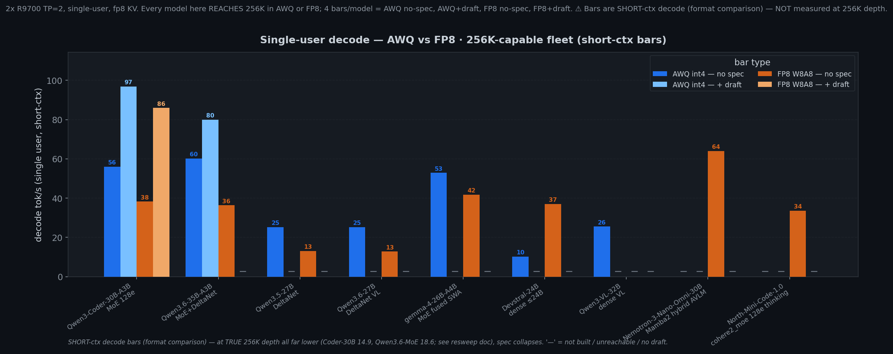
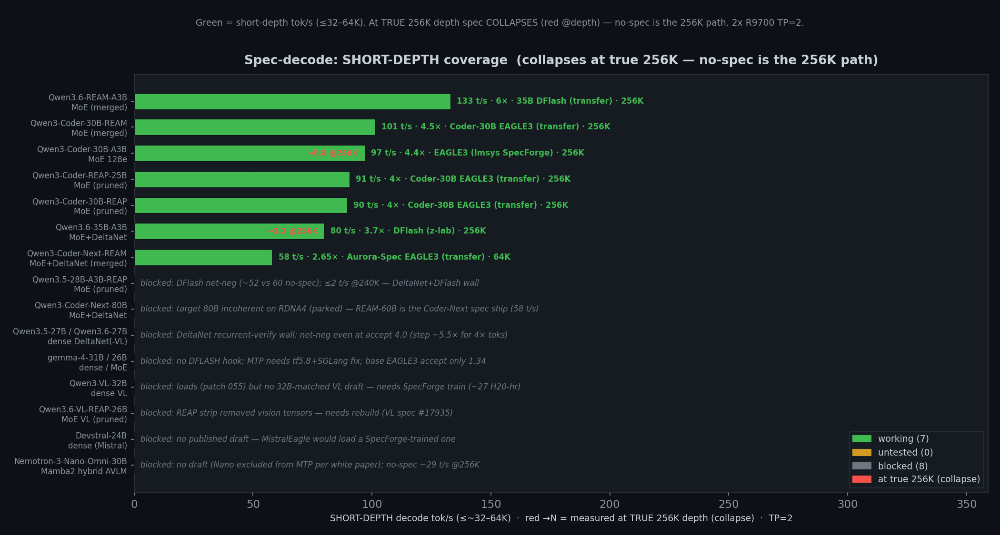

# RDNA4 Inference: SGLang on 2x R9700

> **Coding-task recommendation (cross-team, 3090 SWE-bench Lite, 2026-04-27): `Qwen3-Coder-REAP-25B-A3B-AWQ` — 88/300 = 29.3% (37.3% on instances where tests actually ran).** Same calibrated weights we ship at [`mattbucci/Qwen3-Coder-REAP-25B-A3B-AWQ`](https://huggingface.co/mattbucci/Qwen3-Coder-REAP-25B-A3B-AWQ); harness was opencode v1.14.25 on 3090 stack at 256K ctx, scored locally without Docker. ⚠ This ship was calibrated on Cerebras's pre-pruned BF16 — the in-house rebuild from upstream `Qwen/Qwen3-Coder-30B-A3B-Instruct` is tracked under task #22. Current ship stays live until in-house validates (don't break SWE-bench leadership). Three more models queued in the bake-off (Coder-30B / Qwen3.6-35B-A3B / Devstral-24B). Full disclaimer + raw artifacts in the [3090 repo](https://github.com/mattbucci/2x-3090-GA102-300-A1-sglang-inference) under `evals/swebench/runs/coder-reap-25b-lite/`.

High-throughput LLM inference on 2x AMD Radeon AI PRO R9700 (gfx1201, RDNA4) with ROCm 7.2.  SGLang v0.5.12 + RDNA4 patches (see [patches/README.md](patches/README.md) for applied fixes, architectural investigations, and shipped-fix log).

## Current Focus

**Primary target: single-user 256K context across all supported models.** Multi-user throughput is a secondary concern.  Optimizations that slow batch-32 but improve single-user long-context TPOT are acceptable trades.

**Build models from scratch — never ship random community quants, and prune them ourselves too.** All `mattbucci/*-AWQ` repos are built end-to-end from upstream BF16 bases: when a model needs MoE expert-pruning, we run REAM/REAP ourselves via `scripts/quantize/run_ream_qwen3moe.sh` on the upstream weights — we don't ship from a third-party pre-pruned BF16 (Cerebras, atbender, etc.). Pre-quantized 3rd-party AWQ and pre-pruned BF16 uploads are reference points only — bench against them, don't ship them.

**Hard constraint: preserve thinking, vision, AND video during every calibration.**  Past calibrations silently degraded these. Every requant must pass `scripts/eval/validate_capabilities.py`: basic + thinking + image roundtrip + video motion. Multimodal capability matrix:
- Gemma 4: image + video + audio
- Qwen3.5 / Qwen3.6: image + video (no audio)
- Devstral 24B: image only

**Open work:**
1. **Multi-token tool-name omission recovery** for devstral (`todowrite`/`webfetch` stream in pieces; current hold-back is single-token only).
2. **Dense AWQ decode RESTORED 2026-06-10** (041 scales-dtype fix): qwen36-27b 24.7 / devstral 38.3 / qwen35 22.8 / vl-32b 25.8 @128 (receipts: benchmarks/awq-gemv-fp16-scales-gate-fix-2026-06-10.md). @131K decode is attention-bound (10.5) → long-ctx lever = triton-attn FP32 + TurboQuant KV. (Optional kernel residual: `uint4` 128-bit loads + cheaper packed dequant could push the GEMV past its current ~50–80% roofline. Landed-fix detail: patches/README.md patch 006.)
3. **[UNTESTED] Bring up [`CohereLabs/BLS-Mini-Code-1.0`](https://huggingface.co/CohereLabs/BLS-Mini-Code-1.0)** — a 30B `cohere2_moe` coding model (BF16 base, text-only). New arch class, so SGLang loading + RDNA4 serving are unverified. Steps: confirm it loads on v0.5.12 → cast FP8 + build AWQ from the BF16 base (preserve thinking if present) → validate → SWE-bench coding bench vs the Coder-30B / REAP fleet. See [FP8 lane](#fp8-lane).
4. **[PLANNED] TurboQuant KV-cache quantization (ICLR 2026, [arXiv:2504.19874](https://arxiv.org/abs/2504.19874)) — the ROCm-viable path to sub-FP8 KV.** Data-oblivious online vector quant of the K/V cache (random rotation → concentrated per-coordinate Beta → optimal scalar quantizers): **~3.5 bit/channel quality-neutral, ~2.5 bit marginal** (typ. 3-bit keys / 2-bit values) vs our current 8-bit `fp8_e4m3` KV → **~2.3–3× smaller KV cache**. This is the lever the 256K-only mandate wants: shrinking the KV frees the VRAM that the 2× FP8 weights (+ BF16 vision tower) currently steal, so the **dense/VL FP8 models that cap below 256K (Qwen3-VL-32B ~159K, Devstral-2 ~180K) could reach full 256K in FP8** — and every model gains headroom. Unlike fp4-KV (CUDA-only, blocked here), TurboQuant is **already HIP/ROCm-ported in llama.cpp (gfx1100, RDNA3)** and has a **SGLang WIP PR with fused rotate+quantize Triton kernels** (we already build Triton flash/MoE on gfx1201), so it should port to our RDNA4 stack. **Plan: (1) finish the current fleet SWE-bench smoke at 65K ctx → (2) apply TurboQuant as a patch (port the SGLang Triton kernels / llama.cpp HIP path to gfx1201) → (3) re-smoke the whole fleet at full 256K ctx.** **Validation gate:** single-user M=1 long-context *decode* tok/s must NOT regress — the per-step KV-dequant is the risk (the vLLM POC warns its hybrid decode path dequantizes all history), and single-user decode is the north star, so a KV-quant that slows decode is a non-starter. Win is targeted at the dense/VL FP8 lane; A3B-MoE already reaches 256K (500K–1.6M-tok KV pools). Refs: [SGLang #21618](https://github.com/sgl-project/sglang/issues/21618) / [#23134](https://github.com/sgl-project/sglang/issues/23134), [llama.cpp HIP port #21526](https://github.com/ggml-org/llama.cpp/discussions/21526).
5. **Expand spec-decode coverage — land a working draft on as many models as we can.** Status tracked in [`benchmarks/specdecode.json`](benchmarks/specdecode.json) → fleet chart [`benchmarks/specdecode_fleet.png`](benchmarks/specdecode_fleet.png). **7 already working** — the whole A3B-MoE coder/REAM/REAP family rides EAGLE3/DFlash transfer drafts at 256K (Qwen3.6-REAM-A3B 133, Coder-30B-REAM 101, Coder-30B 97, REAP-25B 91, Coder-30B-REAP 90, Qwen3.6-35B-A3B 80; Coder-Next-REAM 58 @64K). Remaining targets: **(untested — a draft path exists, just bench)** Qwen3.5-28B-A3B-REAP (parent DFlash transfer), Qwen3-Coder-Next-80B (Aurora-Spec EAGLE3); **(blocked — needs work)** DeltaNet-dense 27B pair (Qwen3.5/3.6-27B: DFlash OOMs DeltaNet even @16K → path is AWQ-int4 + BF16-MTP recast), gemma-4-31B/26B (no DFLASH hook; FROZEN_KV_MTP needs transformers 5.8 + an SGLang fix; base EAGLE3 accept only 1.34 → needs an it-matched draft), Qwen3-VL-32B + VL-REAP-26B (SGLang VL spec bug [#17935](https://github.com/sgl-project/sglang/issues/17935), missing `get_embed_and_head`), Devstral-24B (no published draft → SpecForge-train a `MistralForCausalLMEagle`), Nemotron-Omni (no bundled draft, Nano excluded from MTP). Also **re-measure the existing AWQ + FP8 spec bars under cuda-graph** (current spec numbers predate the 2026-06-01 graph-ON sweep). As each lands, flip its `specdecode.json` status to `working` + regenerate both charts (`scripts/bench/generate_charts.py`).
6. **Patch-series audit DONE 2026-06-10 — follow-ups.** All 36 patches verified to apply clean on pristine v0.5.12 AND to reproduce the live serving tree (`/data/vG`) byte-for-byte; index regrouped by lane in [patches/README.md](patches/README.md); REAM tooling moved to `ream-patches/`; stale `components/sglang` workspace refreshed (10 `.rej` leftovers removed). Next: (a) upstream the PR-candidate patches (031/044 allowlists, 037 guard, 033 gelu, 034 isinf, 043 conv1d, 047 duck-type, 046 Triton ptr fix, 048 timeout); (b) at next version bump drop 012+035 (upstreamed in main), rebase 040 onto main's compact `[ARGS]` parser; (c) decide 032 (skinny-GEMM kernel ships unwired since the 038 wiring was dropped — wire-or-archive after the bake-off frees the box).

### FP8 lane

gfx1201 has native FP8 acceleration, so FP8 W8A8 is a serving option alongside the int4 ships. FP8_DYNAMIC = per-output-channel symmetric FP8 weights (compressed-tensors `float-quantized`) + dynamic per-token FP8 activations; lm_head/vision/DeltaNet (`in_proj_*`,`conv1d`)/all gating (`mlp.gate`, `*_gate`, `*.router.*`) stay BF16. Cast with `scripts/quantize/quantize_fp8_manual.py` (NOT llmcompressor — it SIGSEGVs on large MoE), then serve any int4 preset's FP8 dir via launch.sh's `compressed-tensors` auto-detect (`MODEL=<fp8-dir> launch.sh <preset>`). Per-model FP8 max-context / tok/s lives in the [Agent / coding workloads](#agent--coding-workloads-single-user-max-context) table (`AWQ / FP8` columns). FP8 is the clean win for dense ≤24B (Devstral, full 256K) and for spec-decode/batched regimes; AWQ-int4 wins single-user M=1 decode (~1.5×) and is the 256K format for >24B dense/hybrid models (FP8 weights are 2× int4 → context drops near the 32GB limit). **Full casting / serving / perf / spec-decode detail → [patches/README.md](patches/README.md#fp8-serving-on-rdna4-detail).**

**Untested candidate (to bench):** [`CohereLabs/BLS-Mini-Code-1.0`](https://huggingface.co/CohereLabs/BLS-Mini-Code-1.0) — a 30B `cohere2_moe` coding model, BF16 base, text-only. New architecture class (`cohere2_moe`), so SGLang loading + RDNA4 serving are **unverified** — not yet served, calibrated, or benched here. Queued: confirm it loads on our v0.5.12 stack, cast FP8 (+ build AWQ from the BF16 base), then run the SWE-bench coding bench against the Coder-30B / REAP fleet. Tracked once the FP8 bake-off frees the box.

   

   *From [`benchmarks/fp8-comparison.json`](benchmarks/fp8-comparison.json) via `scripts/bench/generate_charts.py::make_fp8_comparison_chart`. **We only care about 256K** — every model here reaches true single-user 256K in AWQ and/or FP8, so there is no max-context panel; it's a single grouped bar chart with **up to 4 bars per model**: AWQ no-spec (blue) · AWQ + draft (light blue) · FP8 no-spec (orange) · FP8 + draft (light orange). Each bar is labelled with its decode tok/s; `—` = not built, not reachable at 256K, or no working draft on this box. **Only the two A3B-MoE models have a working draft at 256K**: Coder-30B + EAGLE3 (AWQ 97 / FP8 86) and Qwen3.6-35B-A3B + DFlash (AWQ 80 / FP8 45 via `--chunked-prefill 2048`). Dense/DeltaNet/SWA models (Qwen3.5-27B, Qwen3.6-27B, gemma-4-26B, Devstral-24B) reach 256K no-spec in both formats but have no working draft; Qwen3-VL-32B is AWQ-256K (no-spec 25.5) but FP8-NA (caps ~159K); Nemotron-Omni is FP8-only. **The three MoE models' no-spec bars (Coder-30B, Qwen3.6-35B, gemma-4-26B) are the 2026-06-01 cuda-graph-ON sweep — both AWQ and FP8 re-measured under graphs for a fair contrast; dense rows are GPU-bound and stay eager (DeltaNet+MoE and the Mamba2-hybrid Nemotron-Omni are dispatch-bound — they capture and gain ~2×, but Nemotron is FP8-only with no AWQ bar here).** spec bars not yet re-measured under graph. (2026-06-08: chart data reconciled to the §256K context-sweep table — DeltaNet-dense 27B AWQ no-spec ~25.3 post patch-006, Qwen3-VL-32B 25.5, Nemotron-Omni FP8 cuda-graph-ON 64.)*

   

   *Spec-decode across the **whole fleet** (broader than the FP8-vs-AWQ subset above), from [`benchmarks/specdecode.json`](benchmarks/specdecode.json) via `scripts/bench/generate_charts.py::make_specdecode_chart`. Green = working draft (label: tok/s · speedup · draft · ctx), yellow = untested (a draft path exists but unbenched), gray = blocked (with the blocker). **7 working / 2 untested / 6 blocked** as of 2026-06-08 — the A3B-MoE coder/REAM/REAP family all ride EAGLE3/DFlash transfer drafts; the dense/DeltaNet/VL/Mamba models are the open targets. Expanding this is [Open work #5](#current-focus).*

### REAM/REAP coverage matrix

`Upstream BF16 base` is always the column-1 anchor — every row starts from a Qwen/Google upstream tensor, never from a third-party prune. ⚠ flags currently-shipped models that were sourced from a 3rd-party pre-pruned BF16 (Cerebras / atbender) before the prune-ourselves rule landed; rebuild tasks track in-house replacement from the upstream BF16.

| Upstream BF16 base | Original AWQ | REAM | REAP |
|---|:---:|:---:|:---:|
| `Qwen/Qwen3.6-35B-A3B` (256 exp, multimodal) | ✅ `Qwen3.6-35B-A3B-AWQ` (in-house) | ✅ `Qwen3.6-REAM-A3B-AWQ` (in-house, Samsung SAIL on upstream BF16); the merge drops `model.visual.*`, so the `-vision` dir splices the parent's tower back (4/4 PASS) | ⚠ `VL-REAP-26B-A3B-AWQ` calibrated on atbender pre-pruned BF16 (vision tower stripped at pre-prune) — rebuild from `Qwen/Qwen3.6-VL-30B-A3B-Instruct` upstream, task #24 |
| `Qwen/Qwen3-Coder-30B-A3B-Instruct` (128 exp) | ✅ `Qwen3-Coder-30B-A3B-AWQ` (in-house) | ✅ `Qwen3-Coder-30B-A3B-REAM-AWQ` (in-house Samsung SAIL on upstream BF16) | ✅ `Qwen3-Coder-30B-A3B-REAP-AWQ` (in-house homegrown REAP `scripts/quantize/run_reap.py` on upstream BF16). ⚠ `Qwen3-Coder-REAP-25B-A3B-AWQ` (separate 25B Cerebras-based variant) still calibrated on pre-pruned BF16 — rebuild via Cerebras's REAP tool on upstream BF16 separately, future task |
| `Qwen/Qwen3-Coder-Next-80B-A3B` (512 exp) | (unshipped) | ✅ `Coder-Next-REAM-AWQ` (in-house Samsung SAIL on upstream BF16, ~60B effective) | ❌ — task #46 |
| `google/gemma-4-26b-a4b-it` (103 exp, multimodal) | ✅ `gemma-4-26B-AWQ` (in-house) | ❌ no shipper | ❌ no shipper |
| `Qwen/Qwen3.5-35B-A3B` (multimodal) | ❌ unshipped | ❌ no shipper | ⚠ `Qwen3.5-28B-A3B-REAP-AWQ` calibrated on Cerebras pre-pruned BF16 — rebuild via Cerebras's REAP tool on upstream BF16, task #23 |

Multi-hour calibrations are authorized and run in the background via `setsid` + PID file; see `CLAUDE.md`.

Grafting BF16 vision/MTP towers onto a quantized ship: see [scripts/quantize/README.md](scripts/quantize/README.md#grafting-bf16-components-from-the-upstream-base-into-a-quantized-ship).

## Known Issues

Open issues only. Resolved items live in [patches/README.md](patches/README.md) and `git log -- README.md`.

- **Nemotron-3-Nano-Omni `bench_serving --dataset-name random` is broken for this Omni model** — it injects an image + ~236 text tokens regardless of `--random-input`; use real long-text prompts to bench.
- **Coder-Next 80B long decode HSAIL 0x1016.** Boots + short-generates after patch 016 (TP=2 conv1d fix); generations past ~400 tokens abort with `HSA_STATUS_ERROR_EXCEPTION 0x1016` inside a Triton kernel — reproduces with `--attention-backend torch_native`, so it's DeltaNet (`causal_conv1d_update` / FLA gated-delta) or NCCL, not attention. Same exception class as Gemma4-31B long-decode crash → likely shared RDNA4-Triton miscompile (wave-32 reduction). Coder-Next-REAM (60B pruned) works. Tracked task #18.
- **GLM-4.5-Air REAP — blocked.** HSA crash in PyTorch `scaled_dot_product_attention` during prefill. Also crashes on [Blackwell GPUs](https://github.com/sgl-project/sglang/issues/18874) (cross-vendor). Likely ROCm/HIP SDPA kernel bug with high GQA ratios.
- **CUDA graphs reserve a 2+ GiB private VRAM pool that fragments long-context allocation** (constraint, not bug). This is why the *global* default is `--disable-cuda-graph`, and why the GPU-*compute*-bound presets keep it off: the **dense / DeltaNet-dense** models (`qwen35`, `qwen36-27b`, `devstral`) profile at ~86% util, so there's no kernel-launch gap for a graph to recover — paying the 2 GiB pool would buy ~0%. **Every MoE / DeltaNet+MoE / Mamba2-hybrid preset overrides it back ON** (`coder-30b`, `coder-reap-25b`, `gemma4`, `qwen35-moe`, `qwen36-moe`, `nemotron-omni`, `coder-next-ream`) — their M=1 decode is *dispatch*-bound, so graph replay is worth **2.0–2.7× (up to ~4× on the qwen36 DeltaNet+MoE family)**, all the way to 256K; the pool is made to fit via per-preset `--mem-fraction` headroom + single-bs capture. Full receipts: [cuda-graph doubles MoE decode](#cuda-graph-doubles-moe-decode).
- **Qwen3.6 temp=0 greedy decode loops** (constraint). Probing with `temperature=0` produces `"Paris\n</think>\nParis\n</think>…"` repetition. Use the model's recommended sampling (`temp=0.7, top_k=20, top_p=0.95`); SGLang picks this up automatically via `sampling_defaults='model'`.
- **[CHASING] int4-AWQ degrades AGENTIC capability on dense *thinking* models — quantization-induced over-thinking, not a serving/format/DeltaNet bug.** Qwen3.5-27B dense int4 AWQ scores **0/6 on the opencode SWE-bench smoke** (6 empty diffs, 0 edits) while **FP8 of the same model = 4/6** on the identical harness/sampling/2048-cap. Decode is healthy (~25 tok/s), so it's not a serving wedge. **What we ruled out:** (1) **tool-call format** — `scripts/quantize/toolcall_calibration.py` (native `<function=>` rows in calibration) drove malformed-call counts to ~0, but resolve stayed 0; (2) **the Gated-DeltaNet recurrent path** — hypothesizing that int4 on `in_proj_qkv` (writes the recurrent state every step) accumulates error over the sequence, we built a selective-precision model keeping the *entire* `linear_attn` path FP16 (`PROTECT_GDN=1`, 14.5 h calib, `modules_to_not_convert=['linear_attn']`, scales clean) → **still 0/6, unchanged.** A direct probe proved it's not a loading artifact: single-turn tool call is clean valid JSON, but a *coherence* probe shows the model **over-thinks and never terminates** — 512 tokens still inside `<think>` on a one-sentence question. **Root cause (literature-grounded):** int4 quantization noise disproportionately corrupts the *high-entropy branching tokens* ("Wait"/"But"/"Alternatively") — KL-divergence at uncertain positions correlates ρ=0.92 with entropy — so the model reaches the right intermediate answer but spirals without committing it (*"in up to 52% of failures … do not output it as a final answer"*, [arXiv:2606.00206](https://arxiv.org/abs/2606.00206); harder/longer tasks degrade up to 4× more, [arXiv:2504.04823](https://arxiv.org/abs/2504.04823)). In an agentic loop that = reads/greps correctly, never commits the edit. Because the branching tokens are decided by the *whole-network logits*, no weight-subset protection fixes it (why GDN-protection failed); FP8's smaller per-weight error preserves those logits → it commits. The **non-thinking** dense int4 ship (Devstral-24B) is agentic-fine → the failure tracks **heavy-thinking + int4**, not int4 or DeltaNet alone. **Levers chased (2026-06-04, all serving-side, no recalibration):** built a sweep rig — serve int4 once with **`--enable-strict-thinking`** (we own the stack; this makes SGLang honor a per-request `custom_params.thinking_budget` that actually caps the think-loop), a sampling-override proxy so the model never reloads, and ran 13 configs through the identical 6-instance harness. Findings: thinking-OFF *under*-thinks (quits with no tool calls); a **bounded thinking budget** gives a clean U-curve (128 under-thinks, **256–384 commits**, 512 re-spirals) and produces **the first edits int4 ever made on this harness (0→1 applied)** — but **no config resolves (0/6 across all 13)**: temp, min_p, presence, repetition penalty, and budget×sampling combos all 0/6. So bounded thinking fixes *whether it commits*, not *whether the edit is correct* — int4 has a hard agentic-*correctness* ceiling on this dense thinking model. **Worthwhile int4 default anyway:** `--enable-strict-thinking` + `thinking_budget≈300` makes int4 agentic runs commit instead of spiral (useful for non-SWE-bench tool use), even though it doesn't lift resolve. **Ship guidance:** FP8 (4/6) is the agentic path for dense thinking models (Qwen3.5/3.6-27B); int4 AWQ is for throughput / non-agentic / single-user 256K decode (see [FP8 lane](#fp8-lane)). Ruled out end-to-end: serving, tool-call format, GDN-recurrent-path, thinking on/off, thinking-budget, and every sampling knob.

### Evergreen cross-team lessons

Terse rules; full forensic write-ups in [CLAUDE.md](CLAUDE.md#cross-team-lessons-full-narrative).

- **`--tool-call-parser` is per-model load-bearing for coding harnesses** — without the right parser, valid tool-call XML lands in `content` as text and the harness runs no edits (qwen36 was 1/300). Map by chat template: qwen3-coder XML → `qwen3_coder` (all Qwen3-Coder + Qwen3.5/3.6); JSON-in-tag → `qwen25`; mistral `[TOOL_CALLS]` → `mistral`; gemma `<|tool>` → `gemma4`. Composes correctly with `--reasoning-parser`.
- **Probe the capability, don't keyword-grep it** — use the content-aware `probe_vision.py`/`probe_thinking.py` trio (STRONG/DEGRADED/FAIL) as the recal gate, not `validate_capabilities.py`'s keyword match (it passed a fabricated VLM answer because "circle" appeared in the text). Also: a rebase that reuses a patch number can silently drop plumbing (M4's pixel_values) while the grep keeps "passing".
- **Self-calibrate; don't trust community quants** — mlx-community ships Gemma4 `embed_vision.embedding_projection` quantized, DeltaNet `in_proj_a/b` INT4, and MoE `mlp.gate` routers INT4 — all violations of our BF16-ignore rules. REAM-merge degrades coder bases ~50% across scaffolds (revisit shipping `Coder-30B-A3B-REAM`).
- **DeltaNet "broken" is usually cache-plumbing, not the arch** — verify each architecture-specific cache type reaches its layer before blaming DeltaNet (uniform `ContiguousKVCache` over hybrid layers → fluent garbage; same class as our Coder-Next conv_state bug).
- **AWQ scales audit needs the base to judge zero-scales (3090 2026-05-31)** — MoE bases ship *dead* channels (`Qwen3.6-35B-A3B`: 50-72% of some layer-0 expert gate/up channels at ~7.8e-38), and AWQ faithfully underflows their fp16 scale to 0 — a benign dead channel, not the v2 dequant-to-zero→NaN bug. `check_awq_scales.py --base <bf16_dir>` downgrades those dead-block zeros while keeping zero-over-*live* as `DEFECT` (qwen36: 144 benign flags → 0 residual; injected live-block zero still caught). **Two gotchas when porting it** (both fixed in 3090 `a2b54dc` via a fleet-wide audit): (1) dead channels come in *two magnitudes* — Qwen3.6 denormals (~1e-38) AND Coder-30B REAP/REAM near-zeros (~1e-26); a `DEAD_THRESH` of 1e-30 misreads the 1e-26 ones as live → false `DEFECT` on clean ships. Use **1e-15** (sits in the >20-order gap below live ~1e-2; no false negatives). (2) Map *both* base layouts — fused `experts.gate_up_proj` (Qwen3.5/3.6) **and** unfused per-expert `experts.{e}.gate_proj.weight` (Qwen3Moe/Coder), else Coder flags stay unresolved. The `qwen36-moe`/`qwen35-moe`/Coder-REAP/REAM ships all carry this structural sparsity, so all need `--base`. 3090 `59db82c`+`a2b54dc`.
- **int4 agentic 0/6 is an int4 × triton-attention interaction at long KV, not an int4 capability ceiling — isolate it with `torch_native` attention *inside* the agentic harness (3090 2026-06-05).** Cross-stack, SWE-bench Lite opencode, same v0.5.12: int4 + FlashInfer (3090) is clean — qwen36-moe 59.0% / qwen36-ream 58.7% (fleet-leading), Devstral 0 garbled tool calls across 262K — while int4 + triton (R9700) = 0/6 and fp8 + triton = 4/6. Removing *either* int4 or triton rescues it → patch-011's triton BF16 precision loss compounding "over many KV tokens" tips int4's noisier high-entropy tool-format logits into malformed emissions, and only at long KV (so the `e772509` single-turn probes couldn't see it). Decisive isolator: re-run the int4 smoke with `--attention-backend torch_native` in the multi-turn harness — 0→nonzero ⇒ attention precision (fix = the triton-attn rekernel; int4 keeps its M=1/256K edge, no FP8 fallback). Tool: `scripts/eval/context_reliability_curve.py` buckets garble-rate by per-step input tokens across {triton,torch_native}×{int4,fp8}. (Resolve-vs-context decline is universal/hardness, not quant.) Full narrative in [CLAUDE.md](CLAUDE.md#cross-team-lessons-full-narrative); 3090 `da1a58e`.
- **"triton attention ⇒ can't cuda-graph capture" is too broad — verify per-preset from the decode-log `cuda graph: True/False` line, not the backend name.** DeltaNet/GDN triton kernels capture cleanly, and on gfx1201 even Gemma's SWA triton-flash captures (gemma4 1.66×, see [§cuda-graph doubles MoE decode](#cuda-graph-doubles-moe-decode)). What blocks capture is specifically a *softmax*-attention triton path the graph engine can't trace — the 3090/sm_86 stack hits this on Gemma (graph stays OFF → ~5× slower, 196 vs 36 tok/s Coder-30B vs gemma4), so a preset can silently run eager. Tell-tale of a missed graph: TPOT flat across context (a real decode step grows with KV) — the qwen36 DeltaNet+MoE family was caught carrying a stale `--disable-cuda-graph` exactly this way. Enabling recipe: single-bs capture `--cuda-graph-max-bs 1 --disable-piecewise-cuda-graph` (piecewise off for the awq_marlin-MoE TP regression) + `--mem-fraction` headroom for graph+warmup. 3090 2026-06-06/07, commit `9531a1a`.
- **Gemma-4-12B *unified* (`Gemma4UnifiedForConditionalGeneration`, the encoder-free omni 12B) needs its arch name added to THREE hybrid-SWA lists or TP>1 crashes on first prefill — `store_cache: expected 2 got 1` (3090 2026-06-07).** Same mixed per-layer-type KV as the 26B/31B — sliding layers `(head_dim=256, kv=8)`, global layers `(head_dim=512, kv=1)` — but its arch string differs from the 26B's `Gemma4ForConditionalGeneration`, so it silently falls out of `configs/model_config.py`'s `is_hybrid_swa_model` (→ uniform MHA pool, one head_dim=512, can't store the sliding layers' `4*256=1024`-wide k), `get_hybrid_layer_ids`, and `is_hybrid_swa_compress` (the flag that makes the kv-cache mixin pass `swa_head_num`/`swa_head_dim` to the SWA sub-pool). Fix = add the arch to all three (3090 patch 047, one-liner each). NOT Ampere-specific — serving the 12B on gfx1201 at TP=2 hits the identical crash; the SWA-pool path is shared SGLang core. The model is the most KV-efficient Gemma (no SigLIP tower; BF16 only ~24 GB) but BF16 KV still caps ~47K @TP=2, so int4 is required for long context.
- **QAT-unquantized bases → AWQ by data-free RTN-from-safetensors; skip calibration AND the model load entirely (3090 2026-06-07).** Google ships `google/gemma-4-12B-it-qat-q4_0-unquantized` (QAT-trained, weights already on a 4-bit grid). Re-quantizing to AWQ group-128 is near-lossless **without any calibration corpus** — MLP layers cos=1.00000 vs base, attn projs 0.993-0.996. No transformers arch recognition needed (5.5.4 doesn't know `gemma4_unified`): pack straight from the safetensors tensors with AutoAWQ's `WQLinear_GEMM.from_linear` (pass `scales`/`zeros` from `AwqQuantizer.pseudo_quantize_tensor`, **transpose to `[in/G, out]`** — `from_linear` indexes the group along dim0). Quantize only the text-decoder Linears; keep vision/audio embedders + norms + lm_head BF16. `check_awq_scales` 0/328, serves awq_marlin, text 4096 quality == BF16. When an arch is too new for llmcompressor/transformers but a QAT base exists, this dodges vendoring the modeling code into the quant env. 3090 recipe `scripts/quantize/quantize_gemma4_12b_qat_rtn_awq.py`.
- **...but RTN-from-QAT only WINS where there's no strong prior AWQ — on already-well-calibrated bases it just TIES (3090 2026-06-07).** We rebuilt all three Gemma 4 sizes from their QAT bases and evaluated against the shipped AWQs: **12B = clear win → shipped** (there was no good prior AWQ); **31B (dense VL) = tie → kept the shipped GPTQ-based AWQ**; **26B (A4B MoE, 128 exp) = tie → kept shipped** (MMLU 23/30 vs 24/30 = one-question noise, HE 14/20 vs 15/15). The hoped-for "QAT conditions EVERY expert → beats GPTQ's rare-expert under-calibration gap" did **not** materialize on the 26B MoE — a well-calibrated GPTQ/AWQ ship is already at the same ceiling, so faithful 4-bit-grid re-quant has nothing left to win. Two MoE-specific notes when trying this: (1) the 26B fused experts are bare `nn.Parameter` (`experts.gate_up_proj [E,2*inter,hidden]` / `experts.down_proj [E,hidden,inter]`, **no `.weight` suffix**) — unfuse per-expert before packing; (2) `experts.down_proj` in-features=704 isn't /128, so **group_size MUST be 32**, which means the per-expert AWQ isn't Marlin-packable and SGLang correctly falls back to the **WNA16 MoE kernel** (boots clean — not a failure). Net: reach for QAT-RTN to *create* an AWQ for an arch that has none; don't expect it to *beat* an existing calibrated ship. 3090 recipe `scripts/quantize/quantize_gemma4_moe_qat_rtn_awq.py`, receipts `benchmarks/quality/gemma4-26b-qat.json`.
- **HumanEval `exec()` of model-generated code needs a subprocess + hard timeout — one pathological generation GIL-spun our whole fleet eval for 4h (3090 2026-06-08).** Our `eval_and_chart.py` ran each HumanEval solution+test via `exec()` inside a `ThreadPoolExecutor` worker. A model emitted an `O(2^n)` `prime_fib` (a recursive-genexpr generation) that never returns; `signal.alarm` can't interrupt it (worker thread, not main), so the run wedged at 99% CPU with **zero server requests** for 4 hours — `py-spy dump` on the hung PID was what finally showed the `exec` frame, not a model/serving bug. Fix = run each solution in an **isolated subprocess** (`subprocess.run([sys.executable,"-c",script], timeout=10)`, returncode==0 == pass); a timeout fails that one item instead of hanging the harness. This *also* firmed the numbers — the pathological gen now correctly **fails** (qwen36 lands HE 39/40, not tanked-by-hang). Any fleet HumanEval harness that `exec()`s untrusted gen in-process has this landmine. 3090 commit `afaa3e7`.
- **Hybrid-SWA KV walls are a CONFIG bug, not a hardware limit — check `--swa-full-tokens-ratio` on your gemma presets (3090 2026-06-10, sprint Track A).** SGLang defaults the sliding-window sub-pool to **0.8× the full pool**, although sliding layers can only attend `window=1024` tokens — on Gemma hybrids the SWA pool is the dominant KV consumer (12B: 153 KB/tok swa vs 15 KB/tok full per GPU) and almost all of it is physically unreachable at low concurrency. Our `gemma4-12b` was "KV-walled at ~102K": setting **`--swa-full-tokens-ratio 0.0625`** took the full pool **102,094 → 565,446 tokens** on the same hardware/mem-fraction, with **tool-use 1.0/1.0 through 258,085 TRUE prompt tokens**, capabilities 5/5, decode within 3% of control (≤64K) + a new ~31 tok/s 128K–256K band. Capacity is exactly `budget/(full_KB + r×swa_KB)` per token — our ladder matched that model to ≤0.1% on all 6 rungs. Floor mechanics: the swa pool only needs `window + chunked-prefill chunk + slack` (~16K tokens; 21K verified working at 258K-true prefill). 26B sweep mid-flight (0.25 already clears 303K full). **Your 32 GB cards have the same 0.8 default** — if your gemma4/gemma4-31b/12B presets serve below 262K real KV, this is likely the binding knob; sweep runner + receipts: 3090 `scripts/bench/swa_ratio_sweep.sh` + `benchmarks/sprint-2026-06-kv-decode/`. **Bonus fix while gating it: 3090 patch 050** — the 12B unified VIDEO path crashed the scheduler (vendored `Gemma4UnifiedVideoProcessor` declares per-FRAME soft tokens, 64, vs the 12×64=768 the embedder emits → `split_with_sizes` crash on the first video request; one-line all-frames fix, 12B now 5/5 omni). Vendored verbatim from transformers main 2026-06-07, so **tx main likely has the same bug** — PR goes to HF transformers; relevant to you only if/when you pick up the 12B. Your dense-GEMV fail-open advisory is queued as our **Track D** (first pass: grep fleet boot logs for per-layer chosen quant method per preset; mismatches get a tok/s A/B — agreed that resolve-rate evals can't see this class). Joint-PR plan ack: you draft 011/±Inf/040-recovery with both stacks' receipts; we'll co-sign with Ampere repro + add our 12-candidate ledger (3090 patches/README.md patch map) for the next batch.
- **Patch-drift audit done (answering your 2026-06-10 banner) — zero content drift, but the pristine REPLAY caught two defect classes `diff -rq`-vs-live cannot see; add both to your audit (3090 2026-06-10).** Import tree verified (`sglang.__file__` → `/data/sglang-rebase-v0512`); series applied to pristine v0.5.12 reproduces it byte-for-byte. The two extra checks worth porting: (1) **require N/N applied, 0 skipped on the pristine replay** — our old 045 was diffed against *pristine* instead of the predecessor-patched tree, conflicted with 040's rewrite of the same block, and the idempotent loop's "skipped (already applied or conflict)" hid it: live tree fine, every FRESH clone silently missing the 12B config remap. (2) **on the fully-patched tree, `git apply --check` must FAIL for every patch** — our old 026's hand-written hunk had no unique anchor, so a setup.sh rerun would have "successfully" patched the *image*-path twin of the video block it targeted. Both fixed in 3090 `b60b64e`; 3-gate recipe + hygiene rules in [3090 patches/README.md](https://github.com/mattbucci/2x-3090-GA102-300-A1-sglang-inference/blob/main/patches/README.md). **Heads-up — we consolidated 33→24 logical patches; your references to our numbers map:** 023+024→**023**, 035/036→**035** (+old 038), 039/040→**039**, 043–048→**043** (incl. the hybrid-SWA arch-list fix you cite as "3090 patch 047"), 017+021→**017**; 002/011/012/018/026/028/030/031/034/041 unchanged; new **049** = your 048 cold-cache TP2 load-timeout graft (thanks — gate-verified live; de-risks our queued 62 GB Nemotron BF16 TP=2 smoke). Our independent upstream-main audit @70c71ba agrees with yours and adds a per-patch ledger (24-row table, same README): drops-on-rebase = our 012/028/030/042 + most of 043; **joint-PR candidates you originated and we both still carry: triton-attn FP32 (your 011 — also your live garbling suspect), sampler ±Inf (your ec1cf36), MistralDetector omission-recovery (your 040/our 041)** — main has none of the three; you own those narratives, we'll co-sign with Ampere repro. Also from the audit: main now ships `Qwen3VLMoeForConditionalGeneration` (registered EntryClass) — relevant if you re-open VL-30B.

## Quick Start

```bash
./scripts/setup.sh                                 # clone SGLang, apply patches, build triton 3.6, create conda env

# Run any model — preset details (max ctx, format, modality) are in the Model Support table:
./scripts/launch.sh devstral                       # also: coder-30b coder-next gemma4 gemma4-31b
./scripts/launch.sh qwen36-moe                     # also: qwen35 qwen35-moe qwen36-27b qwen3vl-32b nemotron-omni

# Recalibrate (calibrate → CT→AWQ → merge vision → launch → validate):
bash scripts/quantize/run_full_pipeline.sh qwen35  # or gemma4-26b, etc.

python scripts/eval/validate_capabilities.py --port 23334   # validate thinking + vision against a live server

bash scripts/bench/bench_256k_sweep.sh             # 256K bench; append a preset (e.g. qwen35-moe) for one model
```

## Prerequisites

- 2x AMD Radeon AI PRO R9700 (or any gfx1201 RDNA4 GPU)
- Linux with ROCm 7.2 (`/opt/rocm`)
- **Custom kernel with `CONFIG_HSA_AMD_P2P=y` + `CONFIG_PCI_P2PDMA=y`** (required for multi-GPU TP=2)
- **`iommu=pt` on the kernel boot cmdline** (IOMMU passthrough — required for *stable* multi-GPU P2P at long context; this is a boot parameter, separate from the kconfig above)
- Miniforge3/Conda
- `pacman -S rocprofiler rccl` (Arch Linux) or equivalent

**P2P is two separate requirements on 2×R9700 — both are load-bearing:**

1. **Kernel P2P config.** Without `CONFIG_HSA_AMD_P2P=y`, single-GPU inference still works but multi-GPU TP falls back to SHM transport (slower, may hang with CUDA graphs). Verify: `zcat /proc/config.gz | grep HSA_AMD_P2P`.
2. **IOMMU passthrough (`iommu=pt`).** With the kconfig present but the IOMMU left in its default lazy DMA-translation mode, *short*-context TP=2 works fine — but **after a large prefill (~128K+ tokens) decode collapses to ~0.3–0.5 tok/s** as RCCL/NCCL endlessly renegotiates P2P channels (log fills with `minNChannels` / `post-adjustment`; NCCL prints `Missing iommu=pt ... can lead to instability or hang`). Passthrough bypasses IOMMU translation for trusted GPU DMA and fixes it. Measured on this box (Coder-30B-A3B-FP8, 256K): **NCCL log lines 178278 → 4, 131K-token decode 0.68 → 16.83 tok/s.** Short-context P2P never trips it — which is why it can hide until you run a long-context job. Verify: `grep iommu=pt /proc/cmdline` and `dmesg | grep -i passthrough` → `iommu: Default domain type: Passthrough`.

On Arch/EndeavourOS, build `linux-zen` with P2P enabled (`asp` was removed from Arch — use devtools `pkgctl`):
```bash
pkgctl repo clone --protocol=https linux-zen
cd linux-zen
echo "CONFIG_HSA_AMD_P2P=y" >> config
echo "CONFIG_PCI_P2PDMA=y" >> config
makepkg -si
```
Then add `iommu=pt` to the boot cmdline. With systemd-boot + kernel-install (this box):
```bash
sudoedit /etc/kernel/cmdline      # append ' iommu=pt' (keep it a single space-separated line)
sudo reinstall-kernels            # regenerates the systemd-boot entries from the new cmdline
sudo reboot
```
(GRUB instead: add `iommu=pt` to `GRUB_CMDLINE_LINUX_DEFAULT` in `/etc/default/grub`, then `sudo grub-mkconfig -o /boot/grub/grub.cfg`.)

## Model Support

### Agent / coding workloads (single-user, max context)

This is the canonical per-model table — AWQ-int4 (the recommended RDNA4 runtime) and FP8 W8A8 (native gfx1201 acceleration) folded into one. **We only care about 256K single-user**, so this table lists the models that reach 256K in at least one format; tok/s are short-ctx single-user decode (`AWQ / FP8`), reconciled to the 2026-05-31 sweep where a slug exists. `—` = format not built/no measured tok/s; `NA` in the FP8 max-ctx column = an FP8 build exists but caps below 256K (so it's out of scope per the 256K-only mandate). Dropped from this table as sub-256K in *both* formats: gemma-4-31B (AWQ ~105K / FP8 ~51K, dense weight-bound), Coder-Next-80B + Coder-Next-REAM-60B (131K-native). (Devstral-2-24B was here as FP8-only ~180K — now reaches full 256K via AWQ, see its row below.) Full per-model FP8 detail in [`benchmarks/fp8-256k-campaign-2026-05-31.json`](benchmarks/fp8-256k-campaign-2026-05-31.json) and the 4-bar chart from [`benchmarks/fp8-comparison.json`](benchmarks/fp8-comparison.json). **All shipped presets re-audited at full 262144 on the current v0.5.12 + patch-006 stack (2026-06-01): every one boots a `max_total_num_tokens ≥ 262144` KV pool with `context_len=262144` and decodes coherently — receipt [`benchmarks/profiling/256k-capability-audit-2026-06-01.txt`](benchmarks/profiling/256k-capability-audit-2026-06-01.txt) (devstral, coder-30b, gemma4, qwen35-moe, qwen36-moe, coder-reap-25b, nemotron-omni; qwen35 / qwen36-27b / qwen3vl-32b / devstral2 confirmed in the same-day sweep).** **Untested — queued for bring-up (not in this table until it serves):** [`CohereLabs/BLS-Mini-Code-1.0`](https://huggingface.co/CohereLabs/BLS-Mini-Code-1.0) (30B `cohere2_moe` coder, BF16, text-only — new arch, SGLang/RDNA4 support unverified; see [FP8 lane](#fp8-lane)).

| Model | Type | Max ctx (AWQ / FP8) | tok/s (AWQ / FP8) | Launch | Status & notes |
|-------|------|:-------------------:|:-----------------:|:------:|----------------|
| Devstral-24B | Dense | 256K / 256K | 10.2 / 37 | `launch.sh devstral` | Working. Text-only Devstral-Small-2507; FP8 par/fits full 256K (413K-tok KV) — the clean dense FP8 win. AWQ no-spec 10.2 (2026-05-31 sweep, conc=1 TPOT ~97ms). No draft. |
| Devstral-2-24B | Dense+VL (Mistral3) | 256K / NA | 41 / — | `launch.sh devstral2` | Working. Devstral-Small-2-24B (Mistral3 + Pixtral vision, **image-only**). **AWQ int4 is the dense-VL 256K win**: int4 weights (~½ FP8) free enough VRAM for a **507K-tok KV pool** → full 262144 *with* the BF16 vision tower resident, where FP8 caps ~180K (weight-size bound; raising mem-fraction doesn't help — switching to AWQ does). basic+vision+tool-call all PASS; **241K-tok needle PASS** (coherent decode, not just KV alloc). Decode (post patch-006 GEMV fix): **41 @128 / 19.6 @131K / 12.5 @256K** tok/s conc=1 — fastest dense AWQ here (40-layer). FP8 = NA under 256K-only mandate. No draft. Ships `mattbucci/Devstral-Small-2-24B-AWQ`. |
| Coder-30B | MoE (128 experts) | 256K / 256K | 56.0 / 38.3 | `launch.sh coder-30b` | Working. FP8 522K-tok KV; **FP8+EAGLE3 = 86 tok/s coherent @256K** (361 MB draft, accept ~5.5); AWQ + EAGLE3 production = 97 tok/s @256K. |
| Gemma 4 26B | MoE (128 experts) | 256K / 256K (triton) | 52.9 / 41.8 | `launch.sh gemma4` | Working (3/4 validate: basic+thinking+vision PASS, video FAIL — `vision.py:254 assert bsz==1` on 12-frame video). 256K (262144) via TRITON flash (validated FP8 + AWQ long prefill, needle retrieved, no OOM); gemma4 preset defaults to triton. The old ~32–64K cap was torch_native-only (ROCm MATH SDPA → O(chunk×ctx) score OOM); `ATTN_BACKEND=torch_native` is the capped fallback. |
| Qwen3.5-27B | DeltaNet hybrid | 262K / 256K | 25 / 13.1 | `launch.sh qwen35` | Working (thinking-aware; thinking PASS in FP8). **AWQ 25 @128 / 14.0 @131K / 10.2 @256K** post patch-006 GEMV fix (was 14.x under the v0.5.12 regression). FP8 native 20.82 GB/card; 256K needs patch 045 + chunked-prefill 2048 (auto in launch.sh) to clear the fallback-GEMM prefill OOM → full 245760-tok prefill @mem0.90, 9.3 tok/s. No working draft (DFlash OOMs DeltaNet; int4-MTP graft accepts ~0). |
| Qwen3-VL-32B | Dense VL | 256K / NA | 25.5 / — | `launch.sh qwen3vl-32b --context-length 262144` | AWQ reaches **full 256K** (KV pool 273174 @mem0.85) — post patch-006 GEMV fix: **25.5 @128 / 12.1 @131K / 7.9 @256K** conc=1 (64-layer dense 32B). **basic+VISION PASS** (content-checked: "red circle … on a white background"). FP8 caps ~159K (<256K) so FP8 = **NA** under the 256K mandate. VL spec broken (#17935). Preset defaults to CTX 32768 — pass `--context-length 262144` for 256K. |
| Qwen3.5-35B MoE | MoE+DeltaNet (256 experts) | 262K / — | 60.7 / — | `launch.sh qwen35-moe` | Working. DeltaNet+MoE holds long ctx best (O(1) linear-attn state). No FP8 build. |
| Qwen3.6-35B-A3B (MoE) | MoE 256e (FUSED) + DeltaNet VL | 262K / 256K | 60.2 / 36.4 | `launch.sh qwen36-moe` | Working — `mattbucci/Qwen3.6-35B-A3B-AWQ`, 256K basic+thinking+vision PASS. FP8 reaches 256K no-spec **+ DFlash@256K** ~45 tok/s (accept ~3.9) via `--chunked-prefill 2048` (auto for qwen36-moe FP8+spec); KV pool 782K. AWQ + DFlash production = 80 tok/s @256K. |
| Qwen3.6-27B | DeltaNet+attn hybrid (VL) | 262K / 256K | 25 / 12.8 | `launch.sh qwen36-27b` | Working (native AWQ); 64 layers in 3:1 linear/full pattern. **AWQ 25 @128 / 13.9 @131K / 10.2 @256K** post the GEMV batched-load fix (patch 006; was 14.5/9.9 under the v0.5.12 regression). FP8 same path as Qwen3.5-27B (shared `qwen3_5` file): native 20.82 GB/card, basic+thinking+VISION 3/3 PASS, 256K via patch 045 + cp2048, 9.3 tok/s @256K. No working draft (same block as Qwen3.5-27B). |
| Coder-REAP-25B | MoE (96 exp, REAP prune of Coder-30B) | 256K / — | 56.8 / — | `launch.sh coder-reap-25b` | Working (self-calibrated code_thinking + native AWQ). Same pure-attention A3B MoE family as Coder-30B. |
| Qwen3.6-REAM-A3B | MoE+DeltaNet (192 exp, REAM prune of 35B), VL | 262K / — | 58.9 / — | `MODEL=...REAM-A3B-AWQ-vision launch.sh qwen36-moe` | Working — 4/4 PASS basic+thinking+vision+video. Text-only build drops all `model.visual.*`, so serve the `-vision` dir (333-tensor tower spliced from parent BF16 via `merge_vision_weights.py --vision-prefix model.visual`). FP8 not built — a 256→192 FP8 re-merge needs the 67 GB parent BF16 resident, which wedges this 64 GB box; ships in AWQ. |
| Nemotron-3-Nano-Omni-30B-A3B | Mamba2-Transformer hybrid MoE, AVLM | — / 256K | — / 64 | `launch.sh nemotron-omni` | FP8-only (NVIDIA ModelOpt FP8, no AWQ variant). 256K (262144) via triton flash; full AVLM (text+image+video+audio) + thinking, first Mamba2 hybrid on the box. torch_native is a slow fallback that OOMs past ~150K (ROCm MATH SDPA only). Requires patches 043/044/046/047 + `pip install librosa`. No spec-decode (no published draft; Nano excluded from MTP). |

All numbers measured with `sglang.bench_serving`.  TPOT = Time Per Output Token (decode only), TTFT = Time To First Token (prefill). Full per-context decode curves: [§256K single-user context sweeps](#256k-single-user-context-sweeps); cuda-graph speedup over eager: [§cuda-graph doubles MoE decode](#cuda-graph-doubles-moe-decode) just below.

#### cuda-graph doubles MoE decode

**cuda-graph is OFF by default on this box but ON for every MoE preset (`coder-30b`, `coder-reap-25b`, `gemma4`, `qwen35-moe`, `qwen36-moe`, `nemotron-omni`, `coder-next-ream`) as of 2026-06-01 — it ~2.0–2.7× their single-user decode.** Profiling `coder-30b` decode (cuda-graph OFF, conc=1, ctx 8K) showed only **~48% GPU utilization** — 40.6 ms wall/step vs **19.5 ms GPU-busy** ([receipt](benchmarks/profiling/coder-30b-decode-profile-2026-06-01.json)). The kernel-family split is `elementwise_norm 29.6% · nccl 24.4% · moe(fused_moe_gptq_awq) 20.1% · awq_gemv 9.5% · rocblas_gemm 8.6%` — i.e. the work is many *tiny* kernels (an A3B MoE activates only ~3B params/token, so the GEMMs are small while the per-layer norm/rope/router/allreduce launch count is fixed). That makes M=1 MoE decode **dispatch-bound**, and cuda-graph replay removes the ~21 ms/step launch gap:

| Model | type | OFF (eager) | ON @short | ON @256K | speedup | validated |
|-------|------|:-----------:|:---------:|:--------:|:-------:|-----------|
| Coder-30B | MoE | 24.7 | **56.0** | 10.6 | 2.27× | coherent code @256K (218K-tok input) |
| Coder-REAP-25B | MoE | 22.9 | **56.8** | 15.2 | 2.48× | coherent |
| Gemma 4 26B | MoE VL | 31.9 | **52.9** | 14.3 | 1.66× | validate_capabilities 3/3 — incl. **vision** under graph |
| Qwen3.5-35B | DeltaNet+MoE | 26.1 | **60.7** | 20.0 | 2.33× | coherent |
| Qwen3.6-35B | DeltaNet+MoE | 26.5 | **60.2** | 19.9 | 2.27× | caps 3/3; **ON-vs-OFF temp-0 bit-exact** |
| Qwen3.6-REAM-A3B | DeltaNet+MoE | 21.8 | **58.9** | 20.0 | 2.70× | coherent |
| Nemotron-Omni **FP8** | Mamba2+MoE hybrid | 31.6 | **64.0** | 45.1 | 2.03× | coherent; **1st FP8 + 1st Mamba2 hybrid captured**; OFF curve flat ~31 → still **1.43×@256K** |
| Coder-Next-REAM 60B | DeltaNet+MoE | 21.8 | **46.4** | 22.3 | 2.13× (1.07×@131K) | coherent; OFF flat ~21 → big win short/mid, but 60B per-token compute (~45 ms) meets the launch ceiling by 131K |

The win is largest at short ctx (the ~21 ms launch gap is fixed while KV-read GPU time grows) and stays positive through 256K. **DeltaNet+MoE** models hold long context best (~20 tok/s @256K vs 10–15 for pure-attention MoE) because their linear-attention state is O(1). Capture is **numerically exact** — qwen36-moe's ON-vs-OFF temp-0 output is bit-identical (sim 1.000), so no DeltaNet/Mamba state corruption. **Dense models stay eager by design**: they're GPU-bound (Qwen3.6-27B ~85.8% util) with no launch gap to remove — which is why the global default is `--disable-cuda-graph` and only the dispatch-bound MoE/hybrid presets flip it back on (`qwen35`, `qwen36-27b` keep it off). Two edge cases in the table above: `nemotron-omni`'s *eager* curve is flat (~31 tok/s — the whole 52-layer Mamba2 hybrid is launch-bound, not just the MoE), so it still gains 1.43× at 256K; `coder-next-ream` (60B) gains 2.13× short but only ~1.07× by 131K, where its real per-token compute meets the launch ceiling (no regression → stays on). Roster is complete — every MoE/hybrid preset captures, only GPU-bound dense stays eager. Toggle any preset with `CUDA_GRAPH_ENABLE=1 launch.sh <preset>`; capture is cheap (~0.3–0.5 GB, ~5–8 s at boot).

> **TTFT note for thinking models:** `bench_serving` measures TTFT to the first **content** token, which on Qwen3.6/Qwen3.5 thinking models includes the entire reasoning pass (≈100–150 thinking tokens before content opens).  Expect a ~4–5s "floor" on TTFT regardless of input length until ctx > 16K, where actual prefill time starts to dominate.  Decode TPOT numbers are unaffected.

**Shipped weights — all calibrated end-to-end from upstream BF16:**

Every `mattbucci/*-AWQ` row below is built by our own scripts (`scripts/quantize/`) starting from the linked upstream tensor — calibration, CT export, native AWQ conversion, scales audit, ship. ⚠ rows mark currently-shipped models that were calibrated on a 3rd-party pre-pruned BF16 (Cerebras / atbender) before the prune-ourselves rule; they're grandfathered live until in-house rebuilds (tasks #22 / #23 / #24) replace them. Every new ship MUST start from a Qwen / Google / Mistral upstream tensor — no exceptions. See the build-from-scratch rule at the top of this README.

> **HF naming convention:** `mattbucci/<ModelName>-<format>` only. Drop descriptive suffixes (`-thinking-vision`, `-4bit`, `-4bit-calibrated`, `-native`, `-v2-fixed`) — the model card carries that detail. `<format>` is `AWQ`, `AWQ-CT`, `GPTQ`, or `GPTQ-CT`. REAM/REAP are part of the model name, not a format suffix. Full rules in [CLAUDE.md](CLAUDE.md#huggingface-naming-convention). Rename non-conforming repos via `huggingface_hub.HfApi.move_repo()` (preserves redirects from the old path).

| Model | HuggingFace | Base |
|-------|-------------|------|
| Devstral-24B AWQ | [mattbucci/Devstral-24B-AWQ](https://huggingface.co/mattbucci/Devstral-24B-AWQ) | [mistralai/Devstral-Small-2507](https://huggingface.co/mistralai/Devstral-Small-2507) |
| Devstral-Small-2-24B AWQ | [mattbucci/Devstral-Small-2-24B-AWQ](https://huggingface.co/mattbucci/Devstral-Small-2-24B-AWQ) | [mistralai/Devstral-Small-2-24B](https://huggingface.co/mistralai/Devstral-Small-2-24B) — **FP8-only upstream (no BF16)**, so built by `dequant_fp8_to_bf16.py` → code+vision AWQ calibration (`quantize_devstral_code_vision.py`); vision_tower + multi_modal_projector + lm_head kept BF16. The dense-VL 256K path. |
| Qwen3.5-27B AWQ | [mattbucci/Qwen3.5-27B-AWQ](https://huggingface.co/mattbucci/Qwen3.5-27B-AWQ) | [Qwen/Qwen3.5-27B](https://huggingface.co/Qwen/Qwen3.5-27B) |
| Gemma 4 26B MoE AWQ | [mattbucci/gemma-4-26B-AWQ](https://huggingface.co/mattbucci/gemma-4-26B-AWQ) | [google/gemma-4-26b-a4b-it](https://huggingface.co/google/gemma-4-26b-a4b-it) |
| Gemma 4 31B AWQ (in-house) | [mattbucci/gemma-4-31B-AWQ](https://huggingface.co/mattbucci/gemma-4-31B-AWQ) — balanced_thinking_vision recipe, 0/410 scale flags, basic+thinking PASS, vision crashes mid-decode (HSAIL 0x1016 — ROCm-side, see `gemma-4-26B-AWQ` for vision workloads) | [google/gemma-4-31b-it](https://huggingface.co/google/gemma-4-31b-it) |
| Qwen3-Coder-30B AWQ | [mattbucci/Qwen3-Coder-30B-A3B-AWQ](https://huggingface.co/mattbucci/Qwen3-Coder-30B-A3B-AWQ) | [Qwen/Qwen3-Coder-30B-A3B](https://huggingface.co/Qwen/Qwen3-Coder-30B-A3B) |
| Qwen3.6-35B-A3B AWQ | [mattbucci/Qwen3.6-35B-A3B-AWQ](https://huggingface.co/mattbucci/Qwen3.6-35B-A3B-AWQ) | [Qwen/Qwen3.6-35B-A3B](https://huggingface.co/Qwen/Qwen3.6-35B-A3B) |
| Qwen3.6-27B AWQ | [mattbucci/Qwen3.6-27B-AWQ](https://huggingface.co/mattbucci/Qwen3.6-27B-AWQ) | [Qwen/Qwen3.6-27B](https://huggingface.co/Qwen/Qwen3.6-27B) |
| ⚠ Qwen3-Coder-REAP-25B-A3B AWQ (3rd-party-base) | [mattbucci/Qwen3-Coder-REAP-25B-A3B-AWQ](https://huggingface.co/mattbucci/Qwen3-Coder-REAP-25B-A3B-AWQ) | **Upstream:** [Qwen/Qwen3-Coder-30B-A3B-Instruct](https://huggingface.co/Qwen/Qwen3-Coder-30B-A3B-Instruct). **Shipped from 3rd-party pre-pruned BF16:** [cerebras/Qwen3-Coder-REAP-25B-A3B](https://huggingface.co/cerebras/Qwen3-Coder-REAP-25B-A3B). Grandfathered until in-house rebuild via Cerebras's REAP tool on the upstream BF16 — task #22. Holds SWE-bench Lite leadership (88/300 = 29.3%). |
| Qwen3.6-REAM-A3B AWQ | [mattbucci/Qwen3.6-REAM-A3B-AWQ](https://huggingface.co/mattbucci/Qwen3.6-REAM-A3B-AWQ) | [Qwen/Qwen3.6-35B-A3B](https://huggingface.co/Qwen/Qwen3.6-35B-A3B) (Samsung SAIL `merge.py`, 256→192 experts) |
| ⚠ Qwen3.6-VL-REAP-26B-A3B AWQ (3rd-party-base) | [mattbucci/Qwen3.6-VL-REAP-26B-A3B-AWQ](https://huggingface.co/mattbucci/Qwen3.6-VL-REAP-26B-A3B-AWQ) | **Upstream:** [Qwen/Qwen3.6-VL-30B-A3B-Instruct](https://huggingface.co/Qwen) (vision-preserving). **Shipped from 3rd-party pre-pruned BF16:** [atbender/Qwen3.6-VL-REAP-26B-A3B](https://huggingface.co/atbender/Qwen3.6-VL-REAP-26B-A3B) — vision tensors dropped at the pre-prune layer, so the shipped AWQ has no working vision. Rebuild path: vision-preserving REAP from upstream BF16, splice vision tower back — task #24 (highest user value of the three rebuilds since it restores vision). |
| Qwen3-Coder-Next-REAM AWQ | [mattbucci/Qwen3-Coder-Next-REAM-AWQ](https://huggingface.co/mattbucci/Qwen3-Coder-Next-REAM-AWQ) | [Qwen/Qwen3-Coder-Next-80B-A3B](https://huggingface.co/Qwen/Qwen3-Coder-Next-80B-A3B) (Samsung SAIL `merge.py`, 512→384 experts, REAM-pruned 60B effective) |
| ⚠ Qwen3.5-28B-A3B-REAP AWQ (3rd-party-base, 3090 ship) | [mattbucci/Qwen3.5-28B-A3B-REAP-AWQ](https://huggingface.co/mattbucci/Qwen3.5-28B-A3B-REAP-AWQ) — `balanced_thinking_vision` recipe; 3/3 PASS basic+thinking+vision on Ampere + 4/4 PASS on R9700. | **Upstream:** [Qwen/Qwen3.5-35B-A3B](https://huggingface.co/Qwen/Qwen3.5-35B-A3B). **Shipped from 3rd-party pre-pruned BF16:** [cerebras/Qwen3.5-28B-A3B-REAP](https://huggingface.co/cerebras/Qwen3.5-28B-A3B-REAP) (Cerebras retained 333 vision tensors at pre-prune, so vision works). Rebuild path: in-house REAP via Cerebras's REAP tool on upstream BF16 — task #23. |
| Qwen3-Coder-30B-A3B-REAM AWQ | [mattbucci/Qwen3-Coder-30B-A3B-REAM-AWQ](https://huggingface.co/mattbucci/Qwen3-Coder-30B-A3B-REAM-AWQ) — in-house REAM merge from upstream BF16. 96 experts (128→96 via Samsung SAIL `merge.py` saliency=reap, grouping=ream, merging=logits+weights, mix_ratio=0.0,0.3,0.7), ~23B/3B-active. code_thinking calibration mix; smoke PASS basic + Fibonacci code-gen on `coder-30b` preset. | [Qwen/Qwen3-Coder-30B-A3B-Instruct](https://huggingface.co/Qwen/Qwen3-Coder-30B-A3B-Instruct) |
| Qwen3-Coder-30B-A3B-REAP AWQ | [mattbucci/Qwen3-Coder-30B-A3B-REAP-AWQ](https://huggingface.co/mattbucci/Qwen3-Coder-30B-A3B-REAP-AWQ) — in-house REAP-prune from upstream BF16 via homegrown pure-pytorch `scripts/quantize/run_reap.py` (128→96 experts per layer, saliency `S = Σ_t gate_t × ‖down_proj_E(x_t)‖₂` over 1024 code-mix samples). AWQ calibrated 1024 samples × 2048 tokens with `moe_calibrate_all_experts=True`, code-thinking recipe (40% code, 25% am_thinking, 20% math, 15% chat). Smoke PASS basic + Fibonacci code-gen. 13GB, 7 shards. | [Qwen/Qwen3-Coder-30B-A3B-Instruct](https://huggingface.co/Qwen/Qwen3-Coder-30B-A3B-Instruct) |

Community checkpoints fail for several architectures (BOS issues, MoE under-calibration, DeltaNet destruction), which is why we self-calibrate.  Pipeline in `scripts/quantize/`.

## Performance (2x R9700, TP=2, SGLang v0.5.12)

All context-sweep numbers: `sglang.bench_serving`, FP8 KV cache, 1 user. cuda-graph follows each preset's default — eager for the GPU-bound dense rows, **ON** for the MoE/hybrid rows (marked `†` in the sweep table below). Results are in `benchmarks/<slug>/results.json`; charts (regenerate with `python scripts/bench/generate_charts.py`) in `benchmarks/`.


See also the [FP8-vs-AWQ comparison chart](#fp8-lane) in the FP8 lane above.

### 256K single-user context sweeps

| Model | 128 | 4K | 16K | 32K | 65K | 131K | 262K |
|-------|:---:|:--:|:---:|:---:|:---:|:----:|:----:|
| Qwen3.5-27B AWQ (DeltaNet dense) | 25.3 | 24.8 | 23.1 | 21.2 | 18.3 | 14.0 | **10.2** |
| Qwen3.6-27B AWQ (DeltaNet dense) | 25.3 | 24.8 | 23.1 | 21.2 | 18.3 | 13.9 | **10.2** |
| Coder-30B AWQ (MoE) † | 56.0 | 54.6 | 48.7 | 42.5 | 34.3 | 21.4 | **10.6** |
| Gemma 4 26B AWQ (MoE) † | 52.9 | 49.6 | 44.1 | 36.9 | 29.7 | 21.4 | **14.3** |
| Coder-REAP-25B AWQ (MoE) † | 56.8 | 48.9 | 48.9 | 42.5 | 34.1 | 23.7 | **15.2** |
| Qwen3.5-35B MoE AWQ (DeltaNet+MoE) † | 60.7 | 58.3 | 53.6 | 48.0 | 39.4 | 27.8 | **20.0** |
| Qwen3.6-35B MoE AWQ (DeltaNet+MoE) † | 60.2 | 58.5 | 53.5 | 48.1 | 39.6 | 28.1 | **19.9** |
| Qwen3.6-REAM-A3B AWQ (DeltaNet+MoE) † | 58.9 | 58.5 | 53.7 | 48.1 | 39.6 | 28.1 | **20.0** |
| Qwen3.6-VL-REAP-26B-A3B AWQ (MoE) ‡ | 21.3 | 21.9 | 21.4 | 20.8 | 21.6 | 20.7 | **16.1** |

† **cuda-graph ON** — 2026-06-01 sweep (`scripts/bench/measure_decode_curve.py`, conc=1, streaming TPOT). Every MoE preset now captures graphs: M=1 MoE decode is dispatch-bound, so graph replay gives **~2.3–2.5× short-ctx decode** over eager (see [cuda-graph doubles MoE decode](#cuda-graph-doubles-moe-decode)). The **DeltaNet+MoE** models (Qwen3.5/3.6-35B, REAM) hold long context best — **~20 tok/s @256K** — because their linear-attention state is O(1), so decode isn't dragged down by a growing KV read the way the pure-attention MoE are (Coder-30B 10.6, gemma-4 14.3 @256K). The two **DeltaNet *dense*** rows (Qwen3.5/3.6-27B) stay cuda-graph **OFF**: they're GPU-bound (~86% util), so there's no launch gap for a graph to remove.

‡ Qwen3.6-VL-REAP-26B-A3B is the pre-cuda-graph text-path number; vision is broken structurally (REAP-stripped tower, capability matrix + task #24), so it's queued for rebuild rather than re-bench.

### Capability matrix of shipped AWQ models

`scripts/eval/validate_capabilities.py` against every shipped `mattbucci/*-AWQ` repo with `chat_template_kwargs={"enable_thinking":False}` for basic and `True` for thinking. Coder models skip thinking probe (no thinking gate).

| Model | basic | thinking | vision | Notes |
|-------|:-----:|:--------:|:------:|-------|
| Qwen3.5-27B-AWQ | ✅ | ✅ | n/a | both paths clean |
| Qwen3.6-27B-AWQ | ✅ | ✅ | ✅ | `balanced_thinking_text` recipe; basic+thinking+vision PASS (video FAIL — text-only recipe). Recipe is hardware-agnostic — same weights serve 3/3 PASS on Ampere. |
| Qwen3.6-35B-A3B-AWQ | ✅ | ✅ | ✅ | 3/3 PASS |
| Qwen3.6-REAM-A3B-AWQ | ✅ | ✅ | ✅ | 4/4 PASS (basic+thinking+vision+video) on the `-vision` dir. The text-only build has no `model.visual.*` weights; splicing the parent BF16's 333-tensor tower restores full multimodal on the int4 ship (no re-merge / recal). |
| Qwen3.6-VL-REAP-26B-A3B-AWQ | ✅ | ✅ | ❌ | `balanced_thinking_vision` recipe; basic+thinking PASS. **Vision is broken structurally** — the REAP prune stripped the vision tower (0 of 70233 tensors have `vision`/`visual` in the name), so RDNA4 HSAILs on image (Ampere falls through to a text-only path and hallucinates). A REAP variant that retains the vision tower (task #24) is the only fix — debugging the HSAIL kernel-side won't recover vision since the inputs are absent. |
| Qwen3-Coder-30B-A3B-AWQ | ✅ | n/a | n/a | clean code on both `/v1/completions` and `/v1/chat/completions` |
| Qwen3-Coder-REAP-25B-A3B-AWQ | ✅ | n/a | n/a | (3090 SWE-bench Lite 88/300 = 29.3%) |
| Qwen3-Coder-Next-REAM-AWQ | ✅ | n/a | n/a | clean code, 24 tok/s flat 128→16K |

**Calibration gotchas:** (1) a text-only recipe on a multimodal model strips `model-vision.safetensors` AND saves text-only architecture; both must be restored from a v1 reference. (2) the LLaVA-Instruct-150K loader needs `data_files="llava_instruct_150k.json"` pinning or it silently falls back to ultrachat — 0 vision samples baked into calibration. (3) VL-REAP-26B has the multimodal class but zero vision tensors — vision crashes are structural from REAP pruning, not calibration.

All values tok/s single-user, conc=1.  The Qwen3.5-27B / Qwen3.6-27B AWQ rows are **post the 2026-06-01 GEMV batched-load fix (patch 006)** — the two DeltaNet-27B hybrids share one measured curve.  Story: these decoded ~24–25 on the pre-v0.5.12 stack, **regressed to ~14 under v0.5.12** (the `awq_gemv_bf16_kernel` became memory-latency-bound — 85.8% GPU util, 78% of decode, ~5× under the ~10.5 ms/step weight-read roofline; *not* dispatch, so cuda-graph gave no help — receipt [`qwen36-27b-decode-profile`](benchmarks/profiling/qwen36-27b-decode-profile-2026-05-31.json)), and are **recovered to ~25 short / 10.2 @256K** by batching `UNROLL=8` in-flight loads in the kernel's inner row-loop (cos=1.0; receipt [`awq_gemv_batchedload-win`](benchmarks/profiling/awq_gemv_batchedload-win-2026-05-31.json)).  The fix benefits every dense/hybrid AWQ model — devstral-2 (40-layer dense) leads at 41/19.6/12.5 (128/131K/256K); Qwen3-VL-32B (64-layer dense) 25.5/12.1/7.9.  Both 35B-A3B MoE models hit the 256K target with similar characteristics (Qwen3.6 edges Qwen3.5 at 256K, 13.3 vs 12.4) and decode via the Triton MoE path, unaffected by the GEMV fix.

### Concurrency (short context)

| Model | Context | conc=1 | conc=4 | conc=8 | conc=32 |
|-------|:-------:|:------:|:------:|:------:|:-------:|
| Devstral-24B AWQ | 32K | 78 | 241 | 476 | **841** |
| Coder-30B AWQ | 32K | 29.5 | 50.3 | 105.3 | **332.3** |
| Gemma 4 26B MoE | 4K | 28.3 | 23.7 | 46.2 | **165.1** |
| Qwen3.5-35B MoE | 262K | 4.8 | 26.1 | 27.3 | 28.4 (max_running clamps to 2) |

### Comparison: 2x R9700 RDNA4 vs 2x RTX 3090

The sister [2x RTX 3090 repo](https://github.com/mattbucci/2x-3090-GA102-300-A1-sglang-inference) runs the same SGLang v0.5.12 + patches stack.

**Sister projects:**
- [3090 GA102 repo](https://github.com/mattbucci/2x-3090-GA102-300-A1-sglang-inference) — Marlin INT4, FlashInfer, NVLink P2P, CUDA graphs.  Same SGLang stack.
- [M4 Apple Silicon repo](https://github.com/mattbucci/m4-sglang-inference) — MLX backend, 64 GB unified mem, no CUDA path.  Confirmed Gemma 4 supports video + audio and Qwen3.5/3.6 support video; their patch 013 root-caused the "DeltaNet broken on VLM-wrapped models" mystery to a cache-routing bug. Durable insight for sliding-window layers (Gemma 4): don't swap RotatingKVCache with quantized-Contiguous on sliding-attention layers — ring-buffer semantics are load-bearing.

| Model | RDNA4 tok/s | 3090 tok/s | Gap | Why |
|-------|:----------:|:---------:|:---:|-----|
| Devstral-24B AWQ | 37 | 87 | 2.4x | Marlin INT4 GEMM + CUDA graphs |
| Coder-30B AWQ | 30 | 193 | 6.4x | Marlin GEMM (~4.5x alone) |
| Qwen3.5-27B AWQ | 25 short / 10.2 @256K | 13.5 | **R9700 ~1.85x short** | DeltaNet Triton on RDNA4 wave32 wins short-ctx (25 vs 13.5). The intermediate "14.4 / parity" was a v0.5.12 GEMV regression, recovered by patch 006 (2026-06-01). |
| Qwen3.6-27B AWQ | 25 short / 14.0 @131K / 10.2 @256K | 21 @131K (CT) | mixed | Same DeltaNet hybrid family as Qwen3.5-27B (3:1 linear/full, 64 layers); both ~25 short post patch-006. We win short-ctx; **3090 leads at 131K (21 vs 14)** — their Marlin/FlashInfer + bandwidth edge at long ctx. |
| Qwen3.5-35B MoE | 16 @32K, 12 @256K | 35 | 1.5-3x | Marlin MoE + FlashInfer |
| Qwen3.6-35B MoE | 21.6 short / 20.6 @131K (native AWQ) | 33 short / 2.6 @250K (native) | varies | We're flatter at long ctx (ROCm-triton); they're faster at short (flashinfer).  Different curve shape. |

Marlin INT4 GEMM and FlashInfer attention give 3090s a consistent **long-context** edge; **R9700 wins DeltaNet hybrids at short context.** Post the patch-006 GEMV fix (2026-06-01), both DeltaNet-27B AWQ hybrids decode ~25 short → 18.3 @65K → 14.0 @131K → 10.2 @256K (measured-identical). Against the 3090: **~1.85× at short ctx** (25 vs 13.5 — DeltaNet Triton on RDNA4 wave32) but the **3090 leads ~1.5× at 131K** (21 vs 14 — Marlin/FlashInfer + bandwidth). *(History: these read ~24–26 pre-v0.5.12, regressed to ~14 under v0.5.12's slow GEMV — which briefly made it look like parity — and were recovered by patch 006's batched-load kernel; see the sweep footnote.)* R9700 also leads on the long-context flatness of the MoE models and the spec-decode multiplier (below).

**Spec-decode (AWQ + draft) cross-stack — same probe both sides** (`merge_intervals`, 256 tok, temp 0.3; receipt [`benchmarks/quality/specdec-vs-3090-2026-05-29.json`](benchmarks/quality/specdec-vs-3090-2026-05-29.json)):

| Model | draft | 3090 (24 GB) | R9700 (32 GB) | absolute | multiplier |
|---|---|:---:|:---:|:---:|:---:|
| Coder-30B-A3B AWQ | EAGLE3 | 185→**306** (1.65×, acc 4.12) | 22.4→**108** (**4.8×**, acc 6.0) | 3090 | **R9700** |
| qwen36-family AWQ | DFlash | 30.6→**126** (4.1×, acc 5.62) | 21.8→**69** (3.2×, acc 3.75) | 3090 | 3090 |

**Absolute tok/s goes to the 3090 on both**, for two structural reasons we can't match: (1) **Marlin INT4 GEMM** gives them ~8× our INT4 decode baseline (185 vs 22 on Coder-30B) — spec-decode amplifies a faster verify step, it can't make the step itself faster; (2) their qwen36 win rides **`SGLANG_ENABLE_SPEC_V2=1` + `--mamba-scheduler-strategy extra_buffer`**, which SGLang gates to CUDA/MUSA/NPU (`AssertionError` on ROCm) and which lifts DFlash acceptance 3.75→5.62 on `Qwen3_5MoeForConditionalGeneration`. **Where R9700 wins:** the Coder-30B **speedup multiplier (4.8× vs 1.65×) and acceptance (6.0 vs 4.12)** — our 32 GB fits the wide EAGLE3 ladder (topk16/draft32) their 24 GB OOMs — plus we run spec-decode at full 256K where they cap at 32K. The one place we *could* win absolute is the DeltaNet dense 27B (we beat their baseline ~2×), but spec-decode there is blocked on both stacks pending a BF16-MTP recast. *(NB: the spec-decode summary table earlier lists tuned/workload-favorable figures — e.g. REAM-A3B 133 was a thinking-workload median; on this coding probe it's 69. Compare like-for-like.)*

## Quality Evals

Run with `scripts/eval/eval_and_chart.py`: MMLU (100 samples), HumanEval pass@1 (30), [LAB-Bench](https://github.com/Future-House/LAB-Bench) (7 benchmarks × 25), Needle-in-Haystack.

| Model | MMLU | HumanEval | LAB-Bench | Needle |
|-------|:----:|:---------:|:---------:|:------:|
| Coder-30B AWQ | **86.0%** | **96.7%** | **38.3%** | 100% |
| Gemma 4 31B AWQ | **91.2%** | 40.0% | 8.6% | — |
| Devstral-24B AWQ | 80.7% | 73.3% | 25.7% | 100% |
| Gemma 4 26B AWQ | 77.2% | — | 3.4% | — |
| Qwen3.5-27B AWQ | 19.3%* | 70.0% | 2.9%* | — |
| Qwen3.5-35B MoE | 10.5%* | 50.0% | 0.0%* | — |

\*Qwen3.5 models use thinking tokens — 512-token MC budget truncates reasoning, giving false low scores.  Re-eval after thinking-aware recalibration.

Every new AWQ must pass `scripts/eval/validate_capabilities.py` (thinking + vision + basic) before entering this table.

### SWE-bench Lite — FP8 agentic coding (buildable subset)

opencode agent → local SGLang FP8 server → no-docker `score_local` (per-repo swebench specs in a uv venv; harness ported from the 3090 stack, driven via `evals/swebench/run_rollouts.py --model sglang/<name>`). Run on a **15-instance buildable subset** (django/seaborn/flask/requests/xarray/pylint) — excludes heavy C-extension repos (astropy/matplotlib/scikit-learn) and ancient instances that fail no-docker env-fidelity. Harness validated: gold patches resolve **2/2** on modern instances. Raw: `benchmarks/swebench/fp8-lite-2026-05-30.json`.

| Model | Resolved | Notes |
|-------|:--------:|-------|
| Qwen3-Coder-30B-A3B-FP8 | **6/15 (40%)** | coder-specialized; **15/15 patches applied**; django 3/3, requests 1/1 |
| Qwen3.6-35B-A3B-FP8 | 2/15 (13%) | generalist+thinking; **7/15 timed out at 600s** (thinking overhead → slow rollouts); several edits regressed p2p |
| Devstral-Small-2-24B-FP8 | deferred | tool-call **tokenizer bug** — HF tekken regex mis-tokenizes `[TOOL_CALLS]` in multi-turn → model emits tool calls as text → empty diffs (0/15). Needs SGLang `mistral_common` routing (model ships `tekken.json`; `is_mistral_model` doesn't match "devstral"). 68% SWE-bench Verified base — would likely lead once fixed. |

⚠ **Not comparable to full-Lite-300 numbers** (e.g. the 3090's Coder-REAP-25B 29.3% in the top banner) — this is a small, buildable-curated subset (higher % expected). It's a relative FP8-model comparison + end-to-end pipeline validation, not a leaderboard figure; full Lite-300 is the follow-up. Both A3B-MoE models serve **256K+ in FP8** (Coder-30B 524K-tok KV, Qwen3.6-35B 1.62M-tok KV — only 3B active); dense Devstral-2 caps ~180K (the BF16 vision tower eats KV).

## Infrastructure Summary

- **SGLang v0.5.12** (vendored at `components/sglang/`) + RDNA4 patches — see [patches/README.md](patches/README.md).
- **Triton 3.6.0** (upstream).  Do NOT clear `~/.triton/cache/` before benchmarking — cold cache produces 100x slower numbers.
- **PyTorch 2.12+rocm7.2**.
- **RCCL 2.27.7** (system ROCm, P2P/IPC on gfx1201 — no custom build).
- **Conda envs**: `sglang-triton36` (inference), `quant` (calibration — llmcompressor pins transformers 4.x, incompatible with SGLang).

See [rules-for-agents.md](rules-for-agents.md) for RDNA4 constraints, launch flags, and quantization rules.  See [CLAUDE.md](CLAUDE.md) for working-mode directives.

## Test System

```
OS:     EndeavourOS (Arch Linux)
Kernel: 7.0.9-zen1-1-zen (custom linux-zen, CONFIG_HSA_AMD_P2P=y + CONFIG_PCI_P2PDMA=y; boot cmdline iommu=pt — required for stable multi-GPU P2P at long context, see below)
CPU:    AMD Ryzen 9 7900 12-Core Processor
RAM:    64 GB DDR5
GPU:    2x AMD Radeon AI PRO R9700 (gfx1201, 32 GB GDDR7 each)
PCIe:   Gen4 x8 per GPU (13.2 GB/s measured) — AM5 is the bottleneck, not Navi 48
ROCm:   7.2.0
RCCL:   2.27.7 (system, P2P/IPC transport with GDR)
Python: 3.12
```

No consumer RDNA4 GPU-to-GPU interconnect exists (no NVLink/XGMI equivalent).  Threadripper TRX50 with Gen5 x16 per slot would lift the PCIe bottleneck.

## Structure

```
patches/              # SGLang v0.5.12 RDNA4 patches + investigations archive
  README.md           #   Applied patches, architectural findings, solved-issue log
  0*.patch            #   patches, apply in order

benchmarks/           # Per-model results + charts (regenerated from results.json)
  <slug>/results.json
  <slug>/README.md

scripts/
  launch.sh           # Unified model launcher — launch.sh <preset>
  common.sh           # Shared RDNA4 env setup (conda, LD_LIBRARY_PATH, etc.)
  setup.sh            # Full setup (patches, conda, build)
  bench/              # Benchmark scripts
  quantize/           # Calibration + CT→AWQ conversion + pipeline runner
  eval/               # Quality evaluation + validator (thinking + vision gate)
  test/               # Tests, debug, profiling, sweeps

components/sglang/    # SGLang v0.5.12 checkout + applied patches
```
