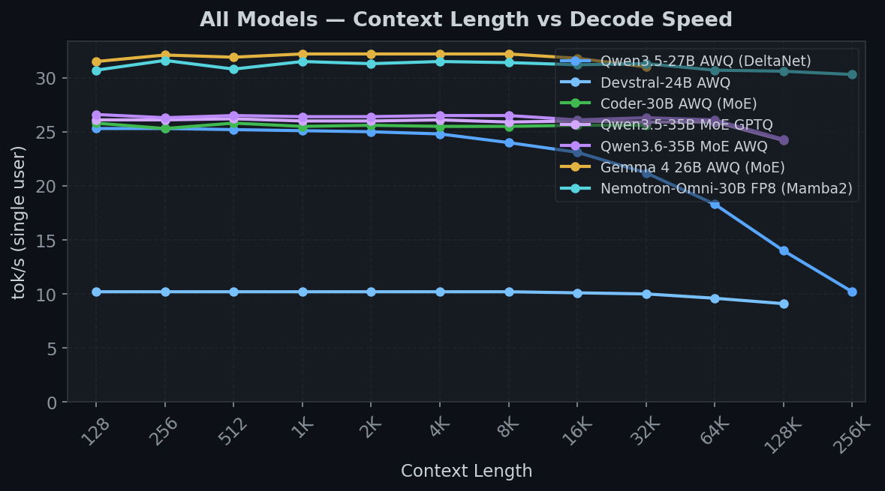
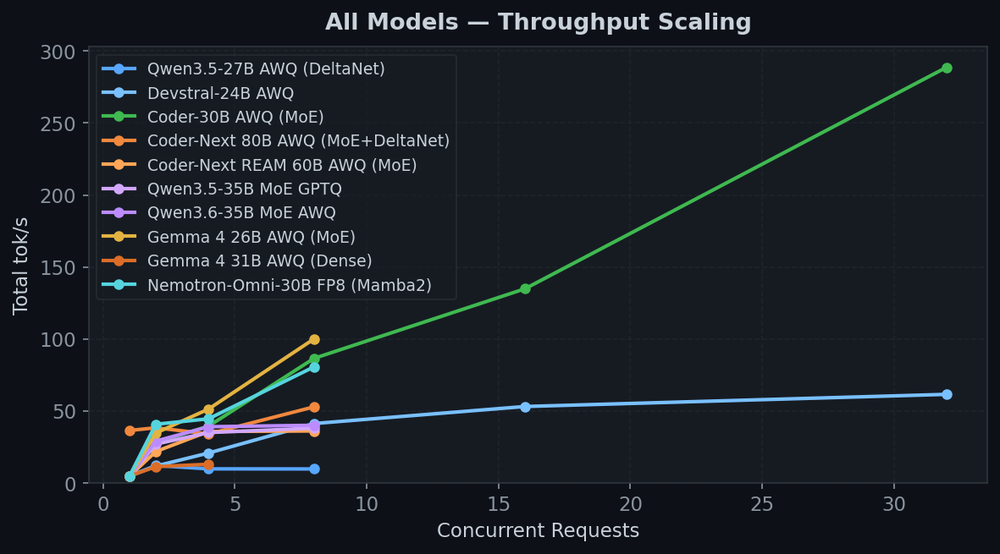
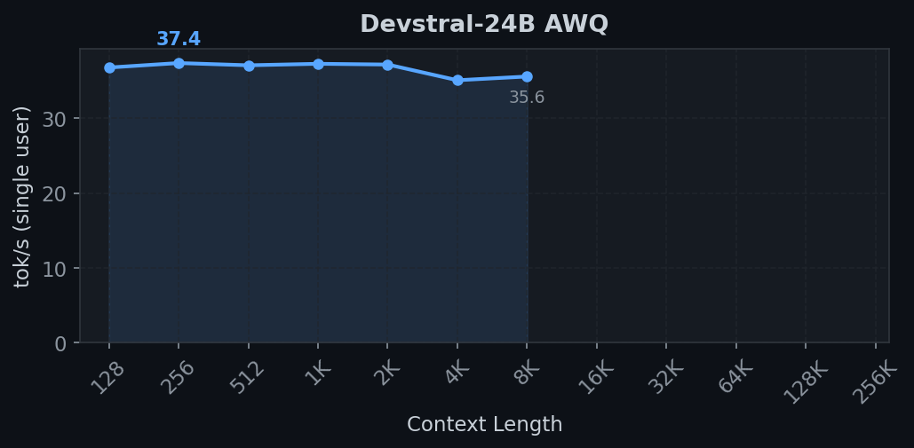
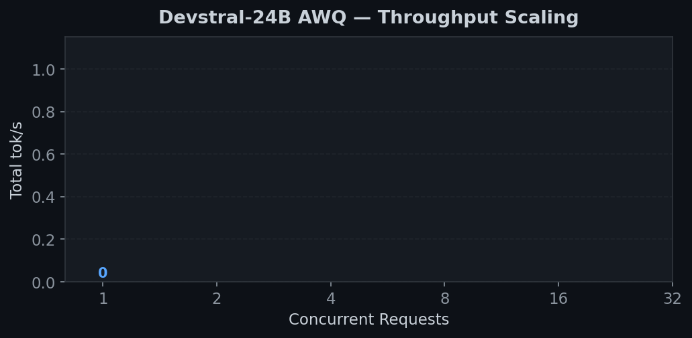
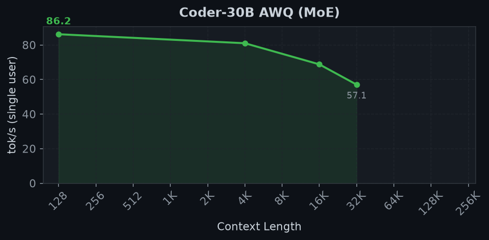
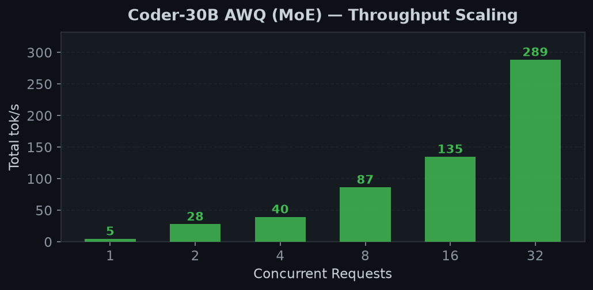
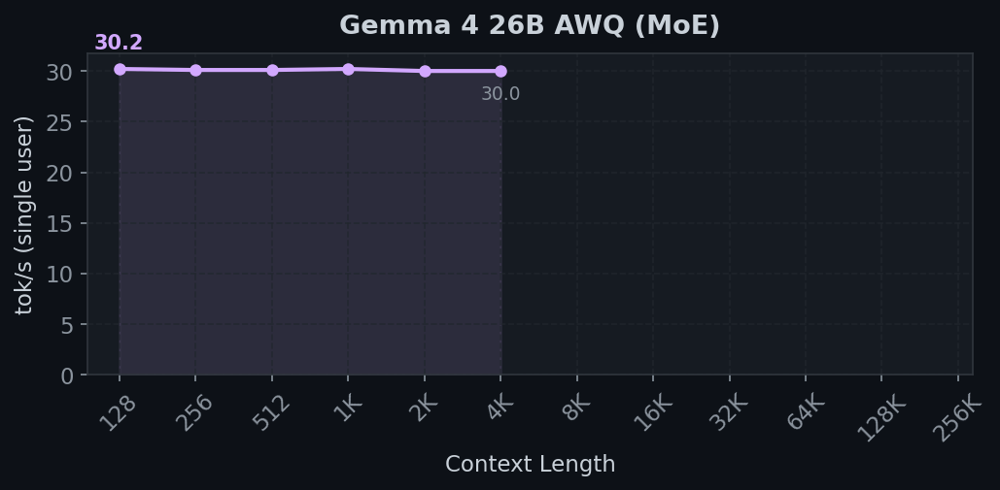
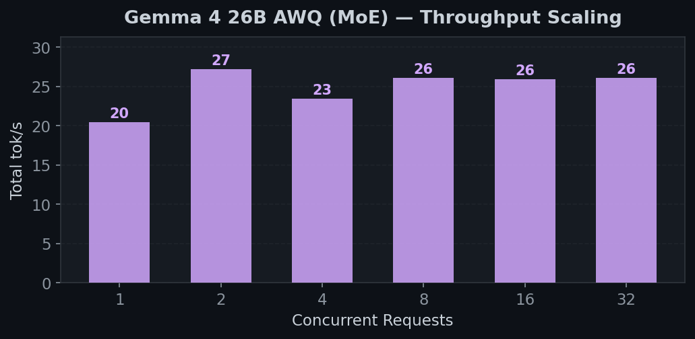
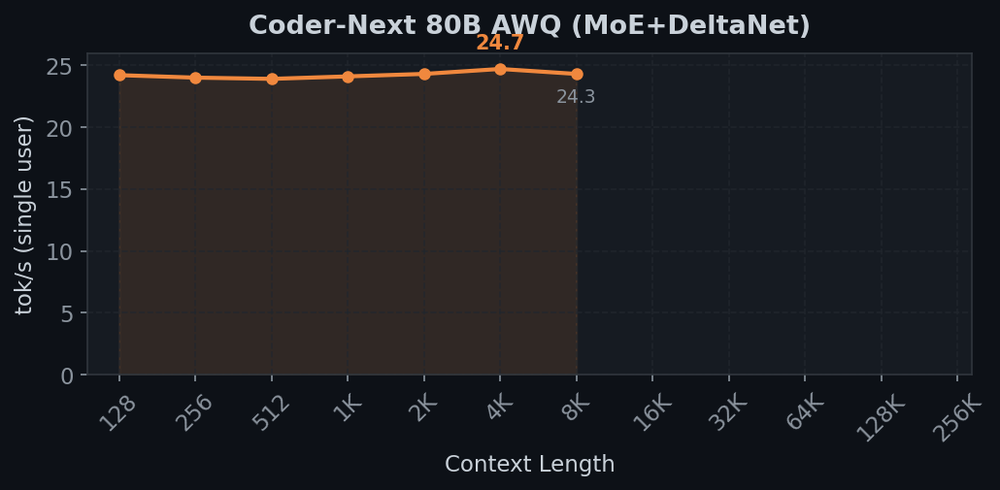
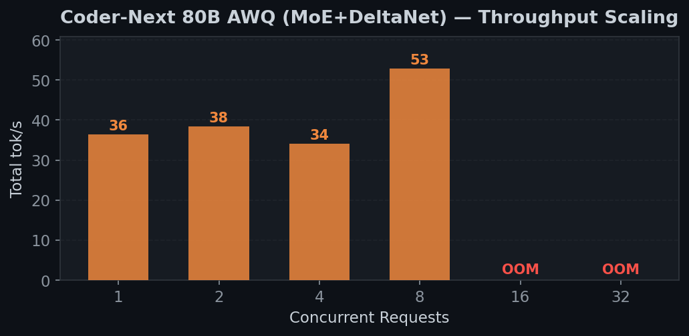

# RDNA4 Inference: SGLang on 2x R9700

High-throughput LLM inference on AMD Radeon AI PRO R9700 (gfx1201, RDNA4) with ROCm 7.2.

## Known Issues

- **Gemma 4 31B Dense** — Working (RTN AWQ 4-bit, BF16 activations, ~19 tok/s). Quality degrades after ~30 tokens with RTN quantization — needs proper GPTQ calibration in BF16 for production use. See [Gemma 31B notes](#gemma-4-31b-dense-notes) below.
- **GLM-4.5-Air REAP** — Blocked. CT format needs Marlin (CUDA-only). CT-to-AWQ conversion done but `moe_intermediate_size=1408` is not TP=2 aligned with group_size=128. Needs AWQ loader patch for non-aligned group boundaries.

## Quick Start

```bash
# 1. Setup: clone SGLang v0.5.10, build triton 3.6, create conda env, apply patches
./scripts/setup.sh

# 2. Run any model:
./scripts/launch.sh devstral            # Devstral-24B AWQ — best all-round
./scripts/launch.sh coder-30b           # Coder-30B MoE AWQ — best throughput
./scripts/launch.sh coder-next          # Coder-Next 80B AWQ — largest model
./scripts/launch.sh gemma4              # Gemma 4 26B MoE AWQ
./scripts/launch.sh gemma4-31b          # Gemma 4 31B Dense AWQ (BF16)

# 3. Test quality
python scripts/eval/eval_comprehensive.py --port 23334 --parallel 4

# 4. Benchmark
python scripts/bench/bench_all_unified.py --name "Model Name" --port 23334
```

## Prerequisites

- 2x AMD Radeon AI PRO R9700 (or any gfx1201 RDNA4 GPU)
- Linux with ROCm 7.2 (`/opt/rocm`)
- **Custom kernel with `CONFIG_HSA_AMD_P2P=y`** (required for multi-GPU TP=2)
- Miniforge3/Conda
- `pacman -S rocprofiler rccl` (Arch Linux) or equivalent

### Kernel: P2P PCIe support

Multi-GPU P2P requires `CONFIG_HSA_AMD_P2P=y` and `CONFIG_PCI_P2PDMA=y` in your
kernel config. Most stock kernels (including `linux-zen`) do **not** enable
`HSA_AMD_P2P`. Without it, RCCL falls back to shared-memory transport (slower,
may cause timeouts with CUDA graphs).

On Arch Linux, build a custom `linux-zen` with P2P enabled:

```bash
asp update linux-zen && asp checkout linux-zen
cd linux-zen/trunk
echo "CONFIG_HSA_AMD_P2P=y" >> config
echo "CONFIG_PCI_P2PDMA=y" >> config
makepkg -si
```

Verify:
```bash
zcat /proc/config.gz | grep HSA_AMD_P2P   # CONFIG_HSA_AMD_P2P=y
cat /sys/module/amdgpu/parameters/pcie_p2p  # Y
```

Without P2P, single-GPU inference still works. Multi-GPU TP will fall back to
SHM transport (check `NCCL_DEBUG=INFO` output for `SHM` vs `P2P/IPC`).

## Model Support (SGLang)

All models run on SGLang with RDNA4 patches. vLLM/llama.cpp used for comparison only.

### Agent / coding workloads (single-user, max context)

Primary use case: agent and coding workflows with maximum context at fast decode speeds.

| Model | Type | Max context | 1-user tok/s | TPOT | Launch | Status |
|-------|------|:----------:|:------------:|:----:|:------:|:------:|
| Devstral-24B AWQ | Dense | 32K | 37 | 27ms | `launch.sh devstral` | Working |
| Coder-30B AWQ | MoE (128 experts) | 32K | 30 | 34ms | `launch.sh coder-30b` | Working |
| Gemma 4 26B AWQ | MoE (128 experts) | 4K | 30 | 33ms | `launch.sh gemma4` | Working |
| Gemma 4 31B AWQ | Dense | 8K | 19 | 53ms | `launch.sh gemma4-31b` | Working* |
| Qwen3.5-27B AWQ | DeltaNet hybrid | 16K | 26 | 38ms | `launch.sh qwen35` | Working |
| Coder-Next 80B AWQ | MoE+DeltaNet (512 experts) | 8K | 24 | 41ms | `launch.sh coder-next` | Working |
| Coder-Next REAM 60B | MoE+DeltaNet (384 experts) | 32K | 25 | 41ms | `launch.sh coder-next-ream` | Working |

All numbers measured with `sglang.bench_serving` (TPOT = Time Per Output Token, decode only).
*Working but RTN quantization — quality degrades on long generation. Needs GPTQ-in-BF16 calibration for production use.

### Batch throughput (multi-user)

| Model | Peak total tok/s | Max conc | Context | Status |
|-------|:----------------:|:--------:|:-------:|:------:|
| Coder-30B AWQ | 166 @32 | 32 | 32K | Working |
| Coder-Next 80B AWQ | 53 @8 | 8 (OOM@16) | 8K | Working |
| Coder-Next REAM 60B | 50 @16 | 16 | 32K | Working |
| Gemma 4 26B AWQ | 27 @32 | 32 | 4K | Working |

**Weights:** Community AWQ checkpoints work for standard architectures (Coder-30B, Coder-Next) but fail for others:
- **Devstral** — community AWQ includes a BOS token that causes `<unk>` output, and vision is broken from quantization damaging the vision-language alignment
- **Gemma 4 26B** — standard GPTQ only calibrated 1/128 experts (inter-expert routing imbalance); we use forced-routing calibration to cover all 128
- **Qwen3.5** — community AWQ produces garbage on DeltaNet layers; we calibrate with GPTQ and keep DeltaNet/SSM layers in BF16

Self-calibrated models use the pipeline in `scripts/quantize/` (GPTQ calibration → CT→AWQ conversion).

**Dense AWQ:** HIP GEMV for M=1 decode (30% faster), dequant+matmul for prefill. Zero Triton in AWQ path.

**MoE AWQ:** HIP GEMV fused expert dispatch (all experts in one GPU kernel). Three RDNA4-specific crash sources fixed: Triton AWQ GEMM, sgl_kernel.topk_softmax, per-expert Python loop.

**DeltaNet hybrid models (Coder-Next, Qwen3.5):** DeltaNet/attention layers kept in BF16 — INT4 quantization destroys quality due to recurrent state error accumulation. This limits decode to ~15-24 tok/s (bandwidth-bound by BF16 weight reads).

**MoE quantization:** Standard GPTQ under-calibrates rare experts (inter-expert imbalance). Use expert-balanced calibration (MoEQuant EBSS or GPTQModel FailSafe). See `rules-for-agents.md`.

**Gemma 4 31B Dense (BF16 required):** Gemma models were [never designed for FP16 inference](https://huggingface.co/google/gemma-3-27b-it/discussions/45) — hidden state values overflow FP16 max (65504) at layer 2. Must use `--dtype bfloat16`. Our AWQ path uses FP32 accumulation in matmul + HIP GEMV in FP16 with BF16 boundary casts. RTN 4-bit quantization (no calibration) produces correct short answers but degrades after ~30 tokens — proper GPTQ-in-BF16 calibration needed for production quality.

## Performance (2x R9700, TP=2, SGLang v0.5.10, updated 2026-04-11)

**Methodology:** All numbers use `sglang.bench_serving` which measures TPOT (decode latency per token) and TTFT (prefill latency) separately. See [benchmarks/README.md](benchmarks/README.md) for full methodology. Regression tests: `./scripts/bench/bench_regression.sh <model>`.

### All models comparison





### Devstral-24B AWQ-4bit

24B dense transformer. ~6.5 GB/GPU AWQ weights. Default config: 32K context.

**32K context (default):** 78 tok/s single-user, 841 @32, 1,266 @64 concurrent.
Quality: **38/39** (math, code, reasoning, vision, parallel)

The charts below show the **262K context config** — most VRAM goes to KV cache at this setting, severely limiting throughput and batching. Use 32K context for max throughput.



<details><summary>262K context sweep (click to expand)</summary>

| Context Length | Time (100 tok) | tok/s |
|:--------------:|:--------------:|:-----:|
| 128            | 4.1s           | 16.0  |
| 1K             | 4.4s           | 16.9  |
| 4K             | 3.7s           | 10.2  |
| 16K            | 5.9s           | 9.6   |
| 32K            | 9.8s           | 3.9   |
| 64K            | 17.3s          | 2.2   |
| 131K           | 40.3s          | 2.0   |
| **262K**       | **96.5s**      | **0.9** |

</details>



<details><summary>262K concurrency sweep (click to expand)</summary>

| Concurrency | Total tok/s |
|:-----------:|:-----------:|
| 1           | 19.7        |
| 2           | 0.9         |
| 4           | 1.6         |
| 8           | 3.6         |
| 16          | 6.6         |
| 32          | 13.2        |

</details>

### Coder-30B AWQ-4bit MoE (32K context, 128 experts)

30B total / 3B active MoE. ~7.9 GB/GPU AWQ weights. Best throughput scaling.



| Context Length | Time (100 tok) | tok/s |
|:--------------:|:--------------:|:-----:|
| 128            | 1.6s           | 28.2  |
| 1K             | 2.1s           | 27.3  |
| 4K             | 3.9s           | 24.6  |
| 8K             | 3.2s           | 16.1  |
| 16K            | 4.3s           | 7.4   |
| **32K**        | **7.8s**       | **4.0** |



| Concurrency | tok/s |
|:-----------:|:-----:|
| 1           | 29.5  |
| 4           | 50.3  |
| 8           | 105.3 |
| 16          | 193.2 |
| **32**      | **332.3** |

### Gemma 4 26B AWQ-4bit MoE (4K context, 128 experts, GPTQ forced-routing)

26B total / 4B active MoE. ~8.5 GB/GPU AWQ weights. GPTQ with forced-routing calibration.



| Context Length | Time (100 tok) | tok/s |
|:--------------:|:--------------:|:-----:|
| 128            | 1.8s           | 27.3  |
| 512            | 1.8s           | 26.4  |
| 1K             | 1.6s           | 23.9  |
| 2K             | 1.5s           | 19.9  |
| **4K**         | **2.2s**       | **18.6** |



| Concurrency | tok/s |
|:-----------:|:-----:|
| 1           | 28.3  |
| 4           | 23.7  |
| 8           | 46.2  |
| 16          | 87.8  |
| **32**      | **165.1** |

### Coder-Next 80B AWQ-4bit (8K context, 512 experts, DeltaNet hybrid)

80B total / 3B active MoE + DeltaNet. ~23 GB/GPU (DeltaNet+attention BF16, only MoE experts quantized).



| Context Length | Time (100 tok) | tok/s |
|:--------------:|:--------------:|:-----:|
| 128            | 4.1s           | 24.2  |
| 1K             | 4.4s           | 22.6  |
| 4K             | 5.6s           | 18.0  |
| **8K**         | **6.9s**       | **14.4** |



| Concurrency | tok/s |
|:-----------:|:-----:|
| 1           | 24.3  |
| 4           | 24.6  |
| **8**       | **24.6** |

Throughput flat ~25 tok/s: VRAM-limited to 1 concurrent (23 GB weights, ~6 GB free).
DeltaNet layers intentionally kept BF16 (INT4 destroys recurrent state quality).
A [REAM variant](https://huggingface.co/cyankiwi/Qwen3-Coder-Next-REAM-AWQ-4bit) prunes 80B→60B, saving 25% VRAM.

### Comparison benchmarks only (not SGLang)

| Model | Engine | Single tok/s | Peak tok/s |
|-------|--------|:------------:|:----------:|
| Coder-Next 80B GGUF | llama.cpp Vulkan | 79 | — |

## Setup

```bash
./scripts/setup.sh
```

Or manually:
```bash
# Clone SGLang, apply patches
cd components/sglang && git checkout v0.5.10
git apply ../../patches/001-rdna4-core-v0.5.10.patch
git apply ../../patches/002-awq-performance-tuning.patch
git apply ../../patches/003-hip-awq-gemv-kernel.patch    # optional: native HIP GEMV
git apply ../../patches/004-sgl-kernel-rdna4-fallbacks.patch  # sgl-kernel graceful degradation

# Create conda env, install dependencies
conda create -n sglang-triton36 python=3.12
conda activate sglang-triton36
pip install torch --index-url https://download.pytorch.org/whl/rocm7.2
pip install triton==3.6.0
pip install -e components/sglang/python
```

## Patches

7 patches on top of SGLang v0.5.10 (~8,600 lines across 50 files):

1. **001-upstream-sync** (3,000 LOC) — Cherry-picks from upstream main: Gemma 4 model, Qwen3.5/3-Next, attention, SWA, pool_configurator. No RDNA4 changes.
2. **002-torch-compile-disable** (56 LOC) — Disable `@torch.compile` on HIP (prevents inductor stalls)
3. **003-sgl-kernel-fallbacks** (669 LOC) — sgl-kernel graceful degradation with torch-native fallbacks
4. **004-moe-fixes** (1,386 LOC) — MoE topk/align fallbacks + 8 Triton 3.6 configs for R9700
5. **005-fp8-fallbacks** (247 LOC) — FP8 torch-native paths for gfx1201
6. **006-awq-kernels** (2,415 LOC) — Fused AWQ Triton GEMM + HIP GEMV (4x decode speedup)
7. **007-model-fixes** (811 LOC) — Gemma4 CT-GPTQ fix, Qwen3.5 TP cache, AWQ gelu, Devstral BOS fix

| Component | Version | Source |
|-----------|---------|--------|
| SGLang | v0.5.10 | stock + 4 patches |
| Triton | 3.6.0 | upstream triton-lang |
| RCCL | system ROCm 7.2 (2.27.7) | no custom build |
| PyTorch | 2.12.0+rocm7.2 | nightly |
| ROCm | 7.2.1 | Arch Linux packages |

## Key Findings

1. **System RCCL 7.2 has P2P/IPC for gfx1201** — no custom RCCL build needed
2. **Upstream triton 3.6.0 works on RDNA4** — `triton-rocm` 3.6 (AMD's PyTorch fork) deadlocks with `LD_PRELOAD`, but the upstream release does not
3. **4 patches** (~5,000 lines across 51 files) get SGLang v0.5.10 running on RDNA4 with near-optimal performance
4. **The single highest-impact change is using fused AWQ GEMM** instead of dequantize+matmul — 4x TPOT improvement
5. **Qwen3.5 TP=2 works** by replicating all layers (DeltaNet + MLP) to avoid FP16 rounding accumulation
6. **sgl_kernel CUDA-only** — pip package fails on ROCm; patch 004 wraps all imports with torch fallbacks

## Qwen3.5-27B Technical Details

Qwen3.5-27B uses a hybrid DeltaNet (linear attention) + full attention architecture.
Running it on RDNA4 with TP=2 requires replicating all layers to avoid FP16 precision
errors from TP matmul splits accumulating through DeltaNet's recurrent state.

**Root cause:** TP RowParallelLinear splits matmul: `W_0@x_0 + W_1@x_1` differs from
`W@x` by ~1 ULP in FP16. DeltaNet's state `S(t) = g*S(t-1) + delta` compounds this
error across 48 layers x N tokens.

**Fix:** Replicate all DeltaNet + MLP layers (`tp_size=1`), float32 all-reduce,
float32 split_k buffer, SSM state `tp_world_size=1`.

VRAM budget (per GPU, 32GB): ~14.3 GB model (replicated) + ~4.0 GB KV cache (256K FP8) + ~2.0 GB overhead = ~20 GB used.

### Quantization pipeline

AWQ-4bit via GPTQ calibration + format conversion (community AWQ models produce garbage on DeltaNet):

```bash
pip install git+https://github.com/vllm-project/llm-compressor.git --no-deps
pip install git+https://github.com/neuralmagic/compressed-tensors.git --no-deps
./scripts/quantize/quantize_qwen35_llmcompressor.sh    # ~6h on 2x R9700
MODEL=~/AI/models/Qwen3.5-27B-AWQ-4bit-calibrated ./scripts/launch.sh qwen35
```

## Devstral-24B Technical Details

Standard Mistral 3 transformer. TP=2 works out of the box with AWQ.

- **Chat template fix:** Community AWQ model includes BOS token causing `<unk>` output. Fixed template in `scripts/devstral_chat_template.jinja`.
- **VLM warmup fix:** Image warmup pollutes radix cache. Fixed by text-only warmup for `Mistral3ForConditionalGeneration`.
- **Vision:** Not working with community AWQ (quantization damaged vision-language alignment).

## MoE Quantization Lessons

Standard GPTQ/AWQ **fails** for MoE models (MoEQuant, ICML 2025). Two critical issues:

1. **Inter-expert imbalance**: Router unevenly distributes calibration data — rare experts get
   zero/garbage calibration. Our Gemma 4 26B GPTQ: 1/128 experts calibrated, rest got inf scales.
2. **DeltaNet/SSM sensitivity**: Recurrent state `S(t) = g*S(t-1) + delta` accumulates INT4
   noise across tokens. DeltaNet layers MUST stay BF16 — this is why Coder-Next AWQ is 15 tok/s.

**Solutions**: Expert-balanced sampling (MoEQuant EBSS, GPTQModel FailSafe), skip recurrent layers.
See [rules-for-agents.md](rules-for-agents.md) for full quantization pipeline and rules.

## Test System

```
OS:     EndeavourOS (Arch Linux)
Kernel: 6.18.0-zen1-1-zen-p2p (custom linux-zen with CONFIG_HSA_AMD_P2P=y)
CPU:    AMD Ryzen 9 7900 12-Core Processor
RAM:    64 GB DDR5
GPU:    2x AMD Radeon AI PRO R9700 (gfx1201, 32GB GDDR7 each)
ROCm:   7.2.0
RCCL:   2.27.7 (system, P2P/IPC transport confirmed)
Python: 3.12
```

## Structure

```
patches/                           # SGLang v0.5.10 RDNA4 patches
  001-rdna4-core-v0.5.10.patch    #   Core support (required)
  002-awq-performance-tuning.patch #   AWQ optimization (+6% decode)
  003-hip-awq-gemv-kernel.patch   #   Native HIP kernel (optional)
  004-sgl-kernel-rdna4-fallbacks.patch # sgl-kernel graceful degradation
benchmarks/                        # Benchmark results (per-model directories)
  {model}/README.md               #   Results + comparisons (renders on GitHub)
  {model}/results.json            #   Structured data from bench_all_unified.py
scripts/
  launch.sh                       #   Unified model launcher (launch.sh <model>)
  common.sh                       #   Shared RDNA4 environment setup
  setup.sh                        #   Full setup (patches, conda, build)
  bench/                          #   Benchmark scripts
  quantize/                       #   Quantization + CT→AWQ conversion
  eval/                           #   Quality evaluation + warmup
  test/                           #   Tests, debug, profiling, sweeps
components/sglang/                 # SGLang v0.5.10 + patches
```
