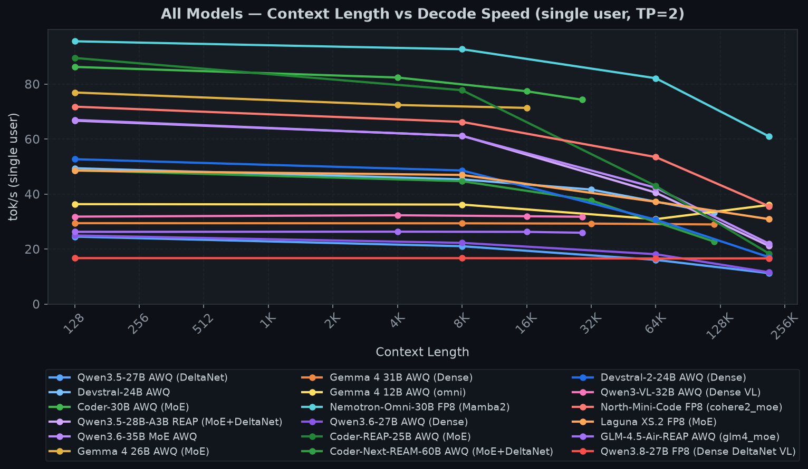
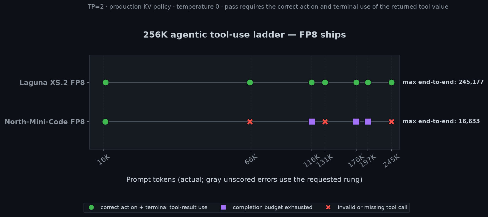

# RDNA4 inference on 2× R9700

SGLang v0.5.20 with 70 local RDNA4 patches, tuned for coherent single-user inference at long context
(256K) on two AMD Radeon AI PRO R9700 GPUs (gfx1201, 32 GiB each, TP=2 over PCIe). The repository holds
the patch series, the preset launcher, the benchmark and evaluation harnesses, the FP8/AWQ quantization
pipeline, and the receipts behind every number below. Multi-user throughput is secondary.

Serving tree `/data/sgl-v0520`, conda environment `sglang-triton36-v0520`, ROCm 7.2. The current focus
is FP8 inference for coding and agentic workloads: Cohere North-Mini Code, Poolside Laguna XS.2, and the
new quality flagship Qwen3.8-27B-FP8.

## Where things stand

- **Nineteen presets boot and serve** on one launcher (`scripts/launch.sh`); 16 of 17 swept presets emit
  parsed structured tool calls at boot (GLM-4.5 Air is receipted as not agentic-qualified).
- **Laguna XS.2 FP8 is the fleet-speed default**: 74.0 tok/s at 62 input tokens and 55.1 tok/s at 220K
  on the native Triton block-FP8 lane (36.8–47.8% over dequant-to-BF16), with a 21/21 seed-rung 256K
  agentic ladder. North-Mini Code passes the same ladder 21/21 to 245,172 actual tokens.
- **Qwen3.8-27B-FP8 is the quality flagship**: fleet-best LAB-Bench 42.3% (no-think multiple choice),
  MMLU 84.2%, HumanEval 93.3%, 7/7 agentic rungs to 245,150 actual tokens, and 22.5 → 20.0 tok/s
  decode from 24 to 197K input on the repaired RDNA4 block-FP8 dispatch (patch 005) with HIP graphs
  (v0.5.20 canonical sweep, 2026-09-19; 16.6 flat before graphs). Its
  seven-scaffold SWE-bench Lite bakeoff (300 instances per cell, Docker-scored) restarted as
  **v3, sandboxed** (running since 2026-09-19 on the v0.5.20 graphs-on stack, every scaffold inside
  the official per-instance SWE-bench image with no network): the v2 lanes had let the agents read
  the upstream fix through future git history and the web on 45–61% of instances, so v2 is
  published only as an exposure study. Setup, the leak audit and the isolation design are in
  [`evals/swebench/FP8_BAKEOFF_SETUP.md`](evals/swebench/FP8_BAKEOFF_SETUP.md).
- **The patch series replays byte-identically** onto pristine v0.5.20 under the strict gate in
  [`patches/README.md`](patches/README.md).

## Results

### Single-user decode across the fleet



Every model runs under its production preset (quantization, graph policy, KV dtype). Curves are
regenerated by [`generate_charts.py`](scripts/bench/generate_charts.py) from each
`benchmarks/<model>/results.json` (three-run streaming-TPOT median, decode-only, actual input-token
counts). The table adds Laguna's current post-089 measurement (five runs, completion-token counted),
which is why its table row is above its plotted 074–082 curve. "Short" ≈ 128-token input; "Deep" is the
deepest measured input. Provenance, raw JSON, and per-model curves are under
[benchmarks/](benchmarks/README.md).

| Model | Class | Short tok/s (input) | Deep tok/s (input) |
|---|---|---:|---:|
| North-Mini-Code-1.0 | FP8 MoE + hybrid SWA | 71.8 (128) | 35.6 (197K) |
| Laguna-XS.2 | FP8 MoE + hybrid SWA | **74.0 (62)** | **55.1 (220K)** |
| Nemotron-3-Nano-Omni-30B | FP8 Mamba2 hybrid MoE | 95.6 (28) | 60.9 (198K) |
| Qwen3-Coder-30B-A3B | AWQ MoE | 88.3 (20) | 57.2 (29K) |
| Qwen3-Coder-REAP-25B-A3B | AWQ MoE | 89.5 (20) | 18.4 (197K) |
| Qwen3-Coder-Next-REAM-60B | AWQ MoE + DeltaNet | 48.6 (20) | 22.7 (110K) |
| GLM-4.5-Air-REAP | AWQ MoE | 25.7 (17) | 25.6 (27K) |
| Qwen3.5-28B-A3B-REAP | AWQ MoE + DeltaNet | 66.7 (22) | 21.1 (197K) |
| Qwen3.6-35B-A3B | AWQ MoE + DeltaNet | 67.0 (22) | 22.0 (197K) |
| Gemma 4 26B-A4B | AWQ MoE + SWA | 74.8 (25) | 58.3 (15K) |
| Devstral-24B | AWQ dense | 47.9 (15) | 23.0 (110K) |
| Devstral-Small-2-24B | AWQ dense + vision | 52.7 (15) | 17.0 (198K) |
| Qwen3.5-27B | AWQ dense + DeltaNet | 24.5 (22) | 11.2 (197K) |
| Qwen3.6-27B | AWQ dense + vision | 24.9 (22) | 11.5 (197K) |
| Qwen3.8-27B | official FP8 dense + DeltaNet (VL + video) | 22.5 (24) | **20.0 (197K)** |
| Qwen3-VL-32B | AWQ dense + vision | 23.4 (20) | 16.5 (27K) |
| Gemma 4 31B | AWQ dense + SWA | 29.4 (25) | 10.5 (110K) |
| Gemma 4 12B | AWQ omni + SWA | 38.6 (25) | 10.9 (198K) |

Gemma 4 26B-A4B caps near 16–30K in its current SWA configuration; the full Coder-Next-80B AWQ
checkpoint is pending (the REAM-60B variant is measured); GLM-4.5-Air runs eager and its short-context
points are noisy. Do not present a short prompt on a 256K-capable server as 256K-depth throughput.

### 256K agentic tool-use ladder



Seven rungs from 16K to ~245K actual prompt tokens, three seeds per model at the model's recommended
sampling, fixed 8,192-token budgets on both turns. Green requires the correct `BANANA42` action and
terminal semantic use of the `KIWI77` tool result **on every seed**; purple is completion-budget
exhaustion (excluded from the action-rate denominator); red is an invalid or missing primary tool call.
The chart is generated from the six schema-v2 seed receipts in
[`benchmarks/quality/`](benchmarks/quality/) and fails closed if the per-seed prompts are not
byte-identical. Qwen3.8-27B-FP8 has a single-profile receipt on the same schema
([JSON](benchmarks/quality/tooluse256k-qwen38-27b-fp8-v0518-r9700.json), 7/7 valid and correct to
245,150 tokens); it is not plotted because it is one profile, not the three-seed contract.

### SWE-bench Lite (official Docker harness)

Resolved rate per model × scaffold from the [2026-07-18 matrix](evals/swebench/bake-off-2026-07-18.md)
(host-side rollouts at CTX=131072 without per-instance venvs, 300 instances per cell; comparable within
the matrix):

| Model preset | opencode | little-coder | claw-code |
|---|:---:|:---:|:---:|
| `coder-30b-a3b` | 36.0% | 25.0% | 17.3% |
| `qwen35-27b` | 45.7% | — | — |
| `qwen36-35b-a3b` | 46.7% | 42.3% | 25.0% |

The Qwen3.8-27B-FP8 cycle (opencode ± DCP, little-coder ± RTK, oh-my-pi, prime-agent, deepagents)
runs at CTX=262144 with per-instance venvs and an `infra_*` audit/re-roll before scoring, so its
matrix will be published as its own dated page rather than merged into the table above. Its first
pass (v2, five lanes complete) is **not a SWE-bench result**: the agents reached the upstream fix
through the mirror's future history (`git log --all`, `git show origin/main:…`; 10–17% of instances
on opencode/omp) and through web fetch/search of the project's tracker, PRs and later releases
(40–47% of instances on every lane), and exposed instances reproduced the gold patch verbatim ~2×
as often as isolated ones. The July matrix above used the same work-tree layout and web-enabled
scaffolds, so both channels were open to it too (its sessions were not audited). The v2 cells are scored and kept as an exposure study
(`qwen38-v2`, stratified by exposure in
[`benchmarks/quality/swebench-leak-audit-qwen38-v2.json`](benchmarks/quality/swebench-leak-audit-qwen38-v2.json);
its two opencode cells also received the task prompt quote-wrapped by opencode `run`, see
`FP8_BAKEOFF_SETUP.md` → Prompt delivery);
the clean matrix is v3, rolling since 2026-09-19 with every scaffold inside the official
per-instance SWE-bench image — its own testbed env, `--network none` with a unix-socket bridge to
SGLang, the tree re-initialised to a single commit (`FP8_BAKEOFF_SETUP.md` → Rollout environments,
Answer leakage and isolation).

## Next steps

Ordered by what runs next. Specs with an ID live in [`experiments/`](experiments/README.md).

1. **Run the Qwen3.8 seven-scaffold bakeoff v3 to completion** (sixth start 2026-09-19 19:56 after
   the five complete v2 lanes were Docker-scored; ~3.5 days per lane at 17 min/instance): every
   scaffold inside the official per-instance SWE-bench image (`run_rollouts.py --docker`: the
   image's testbed env, no network except the SGLang bridge, git re-initialised to one commit;
   the four earlier v3 starts on host venvs + bubblewrap are archived, not scored), both
   little-coder lanes at 262144 / `xhigh` / no thinking cap through the harness (v2 ran
   them as shipped: pi's 32K fallback, `medium`, T=0.3, a 4096-token thinking abort), opencode at
   `limit.context` 262144 (it was the last lane declaring 200000). Then audit,
   re-roll `infra_*`, score, run `audit_git_peek.py` on every lane (must be 0 exposed), publish the
   matrix with the scaffold-disagreement table, and set the v2 exposure study beside it. The v3
   matrix runs every scaffold at an output budget of 32000 tokens (`OUTPUT_BUDGET`; the largest value
   opencode and pi send without clamping) since the fourth v3 start on 2026-09-19: the first start
   still had opencode's v2 cap 8192, which ended 4 of its first 20 sessions on a `length` finish
   with an empty patch (aborted at 20/300, ≈7 h), and at 16384 the next 27 sessions still ended 3
   the same way, so the cycle was restarted once more at 7/300 (≈2.3 h; `FP8_BAKEOFF_SETUP.md` →
   Answer leakage) with the 1800 s timeout unchanged — a runaway think now ends as a timeout with a
   partial patch rather than an empty one. The host-mode environment problems that shaped the
   fourth start (harness venv specs, the `oldest-supported-numpy` downgrade, per-instance venvs
   carried from lane to lane with the previous agent's `pip install`s — 24/300, one uv-breaking)
   do not exist in Docker mode: the image's testbed env is the scorer's, and the container's
   writable layer dies with it (`FP8_BAKEOFF_SETUP.md` → Rollout environments). The fifth
   (Docker) start was itself restarted at 18/300 (≈6 h) once one instance showed that the task
   prompt had been every scaffold's command-line argument: the agent's `pkill -f` of a phrase from
   the issue killed its own scaffold through the argv, and opencode `run` had been re-quoting the
   whole task (`"…"`, inner `"` escaped) in every opencode/opencode-dcp session since 2026-08-31 —
   v2's opencode cells included. The prompt now travels on stdin, verified verbatim on the wire for
   all seven scaffolds before the sixth start (`FP8_BAKEOFF_SETUP.md` → Prompt delivery). At 18/300
   the sixth start had 6 wall hits and 5 empty patches (v2 opencode: 41 and 44 of 300); every wall
   hit ended in one 15–30K-token think in which the model tries to remember the SWE-bench gold patch
   for the instance id it reads off the work-dir path (24 of 25 long thinks; 5/7 wall hits in the
   sessions that name it 30+ times, 0/9 below 10) — v2 answered the same wondering from future git
   history, v3's sandbox turns it into a budget loss (`FP8_BAKEOFF_SETUP.md` → Benchmark recall).
   The matrix-wide thinking-cap and cue-removal decision waits for ~50 instances; nothing changes
   mid-lane.
2. **Chase the residual qwen38 decode gap now that graphs are on.** The 2026-09-19 same-server A/B
   ([receipt](benchmarks/qwen38-27b-fp8/graph-ab-2026-09-19.json), v0.5.18, 3 runs/point, idle CPU)
   measured HIP graphs off→on at 16.9→22.5 (24 tok), 16.9→22.2 (6.5K), 16.8→21.6 (52K) and
   16.0→20.2 tok/s (176K actual input): +26–33%, temp-0 outputs byte-identical in both a think-off
   code task and a thinking math task, 5/5 capability probe under graphs, capture bs=[1] 0.29 GB.
   The preset now runs graphs (`--cuda-graph-max-bs-decode 1`); the v0.5.20 canonical sweep
   ([results.json](benchmarks/qwen38-27b-fp8/results.json)) reads 22.5 / 22.2 / 21.4 / 20.0 tok/s at
   24 / 7.3K / 58K / 197K, the same curve on the new engine. The inherited 2026-06-14 qwen36-27b
   "compute-bound at M=1" verdict was measured under EAGLE3 verify, never on plain decode. The
   remaining gap to the ~25 ms bandwidth floor (~13.5 GB of FP8 weights per rank per step) is the
   next target: `profile_decode_step.sh` (FP8 M=1 Triton block-GEMM) and `p2p_allreduce_bw.py`
   (custom all-reduce over PCIe Gen4 ×8). Every v3 lane from the v0.5.20 restart onward runs graphs
   on; the graphs-off v2/v3 sessions before it are not comparable and are not in the v3 matrix.
3. **Tune the gfx1201 Triton W8A8 block-GEMM configs for the dense FP8 path** — the `N=17408,K=5120`
   analogue of patch 078's MoE tuning
   ([R97-L](experiments/12-fp8-exact-shape-gemm-tuner.md) for Laguna's shared-expert shapes).
4. **Re-measure the suppressed Qwen3.5/Gemma4 LAB-Bench cells with `--mc-no-think`** (the think-budget
   artifact is documented in [`benchmarks/FINDINGS.md`](benchmarks/FINDINGS.md)).
5. **Cut the agentic turn tax at depth** ([R97-J](experiments/10-extend-attention-kv-split-agentic-turn.md)):
   a one-token append to a 176K cached prefix costs 605 ms of TTFT on Laguna because extend does not
   split the KV walk. Gate on numerical equivalence and no cold-prefill regression.
6. **Extend the 256K ladder across the agentic-qualified fleet**
   ([R97-I](experiments/09-fleet-ladder-per-model-rungs.md)), including Nemotron's 2K/8K budget arms
   and the Devstral `KV_DTYPE=auto` versus `fp8_e4m3` control at mem fraction 0.92.
7. **Wire the delivered EAGLE3 drafts into the `--spec` lane and measure the depth curve**
   ([R97-A](experiments/04-eagle3-dense-vl-spec-lane-depth-curve.md)); 3090-measured ≤64K bands are
   Devstral 2.26×/1.91× and Qwen3-VL 1.86×/1.60×.
8. **Ship-gate hygiene**: make the post-save `preprocessor_config.json` / `video_preprocessor_config.json`
   check a hard gate in `scripts/quantize/` (today a `WARN`), and record the actual
   `max_total_num_tokens` pool for every DeltaNet preset under `--max-running > 1` (recurrent state
   replicates per slot; `qwen38` pins `MAX_RUNNING=1` for this reason).
9. **Blocked or deferred**: the Qwen3.6-35B-A3B REAP prune on this host
   ([R97-F](experiments/05-qwen36-35b-reap192-two-rig-relay.md), waiting on the 3090 handoff);
   canonical-eval cells for North/Laguna ([R97-G](experiments/06-north-laguna-canonical-eval-ngram-rows.md)
   Phase B/C); the post-FP8 concurrency re-measure ([R97-O](experiments/15-concurrency-hol-blocking-postfp8-remeasure.md)).
10. **User decisions pending**: decode-topk promotion ([R97-B](experiments/07-decode-topk-promotion-brief.md),
    1.77× at 245K on a pre-v0.5.15 gate; needs regeneration); legacy `bench_serving` directory purge or
    re-measure ([R97-H](experiments/08-bench-dir-hygiene-purge-or-remeasure.md)); pushing the parked
    `ci-build-canary` branch (weekly image build) with a workflow-scoped token.

Notes and asks from the sister rigs are kept in [`CROSS-TEAM.md`](CROSS-TEAM.md), not here.

## Quick start

```bash
./scripts/setup.sh
./scripts/launch.sh north-mini
./scripts/launch.sh laguna

python scripts/eval/validate_capabilities.py --port 23334
bash scripts/bench/bench_256k_sweep.sh north-mini
```

Common overrides:

```bash
CTX=262144 MEM=0.90 PORT=23335 ./scripts/launch.sh laguna
MODEL=/path/to/checkpoint ./scripts/launch.sh qwen36-moe
ENV_NAME=other-env SGLANG_DIR=/path/to/sglang ./scripts/launch.sh coder-30b
GPU_IDS=0 TP=1 ./scripts/launch.sh coder-30b
ENABLE_OVERLAP_SCHEDULE=1 ./scripts/launch.sh laguna  # experimental scheduler A/B
```

The model checkpoint controls compressed-tensors FP8 detection. Presets supply the validated attention
backend, quantization path, parsers, memory settings, and graph policy.

## Current stack

| Component | Version |
|---|---|
| GPUs | 2× AMD Radeon AI PRO R9700, gfx1201, 32 GiB each |
| SGLang | v0.5.20 + 70 patches |
| Python | 3.12 |
| PyTorch | 2.11.0+rocm7.2 |
| ROCm | 7.2 |
| Triton | 3.6.0 |
| RCCL | 2.27.7 |
| transformers | 5.12.1 |

v0.5.20 (tag published 2026-09-18) is the newest upstream release as of 2026-09-19; `/data/sgl-v0520` sits on its
peeled commit `94602c9c2`. Upstream `main` was 241 unreleased commits ahead on that date and is not tracked:
the patch series and the native HIP kernel builds pin to release tags, and the next rebase waits for the
v0.5.21 tag (the ~2-week cadence puts it near 2026-10-02) and a bake-off lane boundary. Rebase procedure and
per-version receipts: [`patches/README.md`](patches/README.md).

TP=2 requires both kernel P2P support and IOMMU passthrough:

```bash
zcat /proc/config.gz | grep -E 'CONFIG_HSA_AMD_P2P|CONFIG_PCI_P2PDMA'
grep -o 'iommu=pt' /proc/cmdline
```

Required kernel settings are `CONFIG_HSA_AMD_P2P=y`, `CONFIG_PCI_P2PDMA=y`, and the boot argument
`iommu=pt`. `HSA_FORCE_FINE_GRAIN_PCIE=1` remains enabled but is not a substitute for those
requirements. Because `iommu=pt` reduces DMA isolation, use this configuration only on a dedicated host
with trusted workloads; GPU passthrough is not a safe multi-tenant sandbox.

### OCI image

`Dockerfile` builds the ROCm 7.2/v0.5.20 stack without a GPU; GitHub Actions promotes verified digests
to `ghcr.io/<owner>/sglang-rdna4`. The image is hardened for untrusted networks (keyed API, fail-closed
preset launcher, disabled remote code and media by default) and must still sit behind a private network
and an authenticating TLS proxy. Device selection, secrets, `docker run` recipes, the read-only
root-filesystem layout, and the full threat model are in [`docker/README.md`](docker/README.md).

## Supported presets

`scripts/launch.sh` is the source of truth for model paths and runtime flags.

| Preset | Model family | Primary lane | Context |
|---|---|---|---:|
| `north-mini` | North-Mini-Code-1.0 | FP8 MoE + hybrid SWA | 256K |
| `laguna` | Laguna-XS.2 | FP8 MoE + hybrid SWA | 256K |
| `coder-30b` | Qwen3-Coder-30B-A3B | AWQ MoE | 32K default; 256K capable |
| `coder-reap-25b` | Qwen3-Coder REAP 25B-A3B | AWQ MoE | 256K |
| `coder-next` | Qwen3-Coder-Next-80B | AWQ MoE + DeltaNet | 128K |
| `coder-next-ream` | Coder-Next REAM | AWQ MoE + DeltaNet | 128K |
| `devstral` | Devstral-24B | AWQ dense | model preset |
| `devstral2` | Devstral-Small-2-24B | AWQ dense + vision | 256K |
| `qwen35` | Qwen3.5-27B | AWQ/FP8 DeltaNet | 256K |
| `qwen35-moe` | Qwen3.5-35B-A3B | AWQ MoE + DeltaNet | 256K |
| `qwen36-27b` | Qwen3.6-27B | AWQ/FP8 DeltaNet + vision | 256K |
| `qwen38` | Qwen3.8-27B | official FP8 (block) DeltaNet + vision + video | 256K |
| `qwen36-moe` | Qwen3.6-35B-A3B | AWQ/FP8 MoE + DeltaNet | 256K |
| `qwen3vl-32b` | Qwen3-VL-32B | AWQ dense + vision | 256K override |
| `gemma4` | Gemma 4 26B-A4B | AWQ/FP8 MoE + vision | 256K |
| `gemma4-12b` | Gemma 4 12B Unified | AWQ multimodal | 256K |
| `gemma4-31b` | Gemma 4 31B | AWQ dense + vision | 256K override |
| `nemotron-omni` | Nemotron-3-Nano-Omni | FP8 Mamba2 hybrid MoE | 256K |
| `glm45-air` | GLM-4.5-Air REAP | AWQ MoE | 32K |

Additional fallback presets exist for Gemma 4 31B checkpoint formats; `./scripts/launch.sh -h` lists
everything.

## Runtime policy

- Use CUDA/HIP graphs for dispatch-bound MoE and recurrent hybrid presets; keep compute-bound dense
  presets eager unless an A/B shows a gain (qwen38 dense DeltaNet FP8 gained +26–33% on plain
  M=1 decode with identical outputs, so it runs graphs; see next steps).
- Use FP8 for native gfx1201 FP8 checkpoints and dense-thinking agentic workloads that lose quality
  under int4; use AWQ int4 for weight-bandwidth-bound single-user decode and for models that need the
  extra KV capacity.
- Use no speculative decoding at true 256K depth. The validated speculative lane is limited to short
  and medium context.
- Treat tool-call and reasoning parsers as model-specific correctness settings, not optional
  presentation features.
- Keep the Triton cache warm when collecting comparative numbers.
- On gfx1201, decode `num_kv_splits` defaults to 64 (patch 086), not the AMD default of 16, so the
  flash-decode grid fills the 64 CUs at long context; override with `SGLANG_KV_SPLITS_OVERRIDE`.
- Native Triton dense block-FP8 is Laguna's default (36.8–47.8% over `auto`); roll back with
  `FP8_GEMM_BACKEND=auto ./scripts/launch.sh laguna`. Do not use the stock SGLang block-FP8 tuner on
  gfx1201: its unrolled search is not the production path and lacks the correctness gates Laguna's
  K=256 shape needs.
- Keep Laguna overlap scheduling off for single-user decode. `ENABLE_OVERLAP_SCHEDULE=1` is an
  experimental concurrency/shared-prefix A/B, not a proven deep-context default.

## Validation and quantization

Every new or modified ship must pass weight and scale integrity, basic generation, the applicable
reasoning/tool-call/image/video/audio probes, long-context coherent generation, and a same-method
performance baseline:

```bash
python scripts/eval/check_awq_scales.py /path/to/awq --base /path/to/bf16
python scripts/eval/validate_capabilities.py --port 23334
bash scripts/quantize/run_full_pipeline.sh qwen35   # full AWQ pipeline, base check included
```

The AWQ base comparator distinguishes benign zero scales over dead MoE channels from zero scales over
live weights. Build `mattbucci/*` releases from the upstream BF16 checkpoint with the repository's own
calibration and pruning scripts; community quantizations are reference data, not release inputs.

## Known limitations

- Long-running TP=2 harnesses can expose one-rank stalls that short serving probes do not. Use the
  watchdog and capture scheduler stacks on recurrence.
- Back-to-back TP=2 relaunches intermittently hit an RCCL-init GPU coredump (rank exit -6): a hard kill
  leaks the communicator's `/dev/shm` IPC segments and a fast relaunch faults on a stale one. Run
  `bash scripts/free_gpu.sh` between serving runs.
- Coder-Next full-size and GLM-4.5-Air remain diagnostic presets rather than recommended agentic ships;
  Qwen3-Coder-30B REAM is research-only until it passes a same-scaffold quality comparison against the
  unmerged checkpoint.
- Gemma 4 31B vision and video are non-functional on the local `gemma-4-31B-AWQ` checkpoint: it carries
  no `vision_tower.*` weights (the tower is randomly initialized at load, on every SGLang version), so the
  probe answers are hallucinated; use the 12B or 26B Gemma presets for multimodal workloads.
- Verbatim needle recall at ~198K is at the boundary for the two recurrent/windowed presets, on every
  engine version: nemotron-omni greedily returns the planted values' digits without their alpha prefix
  (`MID=2291 LATE=7734`, byte-identical on v0.5.18 and v0.5.20, full-form to 88K) and north-mini answers
  not-found; a single T=0.7 sample on either lands on either side of that boundary, so fleet-run LATE flips on
  these two presets are not regressions
  ([controls](benchmarks/validation/deep-probe-controls-v0518-v0520-2026-09-19.json)).
- North-Mini-Code's previous ~120K recall ceiling is withdrawn: it was measured under incorrect
  centered-LayerNorm semantics and partly without checkpoint KV scales. Served correctly (patches
  090–095) it shows no agentic ceiling below 262,144. The pre-fix curve in
  [flagship-recall-depth-2026-07-16.md](benchmarks/flagship-recall-depth-2026-07-16.md) is a superseded
  incident record.
- Dense Qwen3.5/3.6 int4 checkpoints are throughput options; FP8 is the preferred agentic format.
- Devstral tokenization requires patch 083 so rendered `[INST]` and `[TOOL_CALLS]` markers remain
  single special tokens.
- Do not use DCP2 with the TP2 GQA coding presets: adjacent ranks hold distinct K/V heads while the DCP
  MHA reduction requires replicated K/V heads inside each group; North/Laguna also lack hybrid-SWA DCP
  support.
- **Agentic turns at depth are prefill-bound, not decode-bound** (Laguna, 2026-07-19): appending a
  short suffix to a cached prefix pays a tax proportional to prefix length — 604.6 ms of TTFT at
  176,588 cached tokens for one token, 607.7 ms for 64 — because the extend grid
  (`extend_attention.py:63`) collapses to ~24 workgroups per rank on a short suffix while decode
  splits the same walk 64 ways. Fit: `TTFT_ms ≈ 32.7 + 3.226 per 1000 cached tokens`. Tracked as
  [R97-J](experiments/10-extend-attention-kv-split-agentic-turn.md); North-Mini untested.
- The AWQ M=1 decode GEMV under-fills the 64 CUs on narrow-output projections (attn_o ~33–52% of
  roofline). Grid-level split-K was implemented and **refuted** — it regresses; the cap is per-CU
  wavefront occupancy, not block count. Details:
  [dense-gemv-narrow-n-splitk-handoff.md](benchmarks/dense-gemv-narrow-n-splitk-handoff.md).

Final experiment dispositions are summarized in [benchmarks/FINDINGS.md](benchmarks/FINDINGS.md).

## Repository map

| Path | Purpose |
|---|---|
| [scripts/](scripts/README.md) | setup, launch, benchmark, evaluation, quantization, and test entry points |
| [patches/](patches/README.md) | ordered SGLang v0.5.20 patch series and the replay gate |
| [PATCHES.md](PATCHES.md) | cross-environment patch inventory |
| [benchmarks/](benchmarks/README.md) | current results, raw JSON, charts, and consolidated findings |
| [evals/swebench/](evals/swebench/FP8_BAKEOFF_SETUP.md) | SWE-bench Lite bakeoff harness, audit, and Docker scoring |
| [experiments/](experiments/README.md) | vetted experiment specs and the execution queue |
| [docker/](docker/README.md) | OCI image build, hardening, and run recipes |
| [CROSS-TEAM.md](CROSS-TEAM.md) | inbox for sister-rig notes and asks |
| [rules-for-agents.md](rules-for-agents.md) | operational and calibration invariants |
| [CLAUDE.md](CLAUDE.md) | concise repository working instructions |
