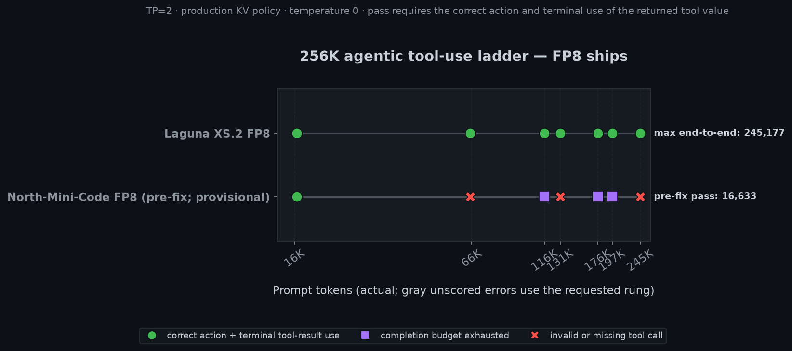
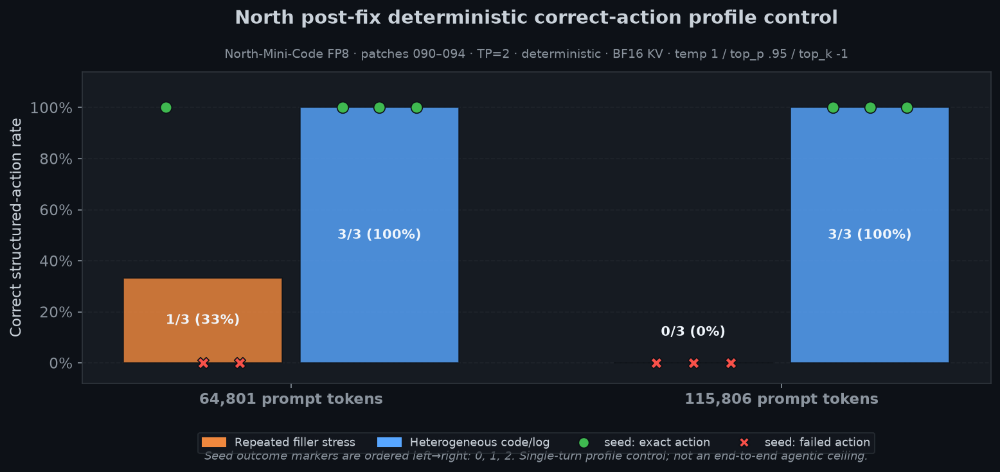

# Benchmarks

Measurements for tensor-parallel inference on two AMD Radeon AI PRO R9700 GPUs (gfx1201). Results are
only comparable when the model, SGLang stack, context depth, graph mode, quantization, and measurement
method match.

## Results by campaign

The whole servable fleet was measured on the 2026-07-12 v0.5.15 + patches 074–082 campaign tree with one
consistent method: streaming-TPOT median (3 runs, decode-only, actual input-token counts), ROCm 7.2, TP=2,
each model under its production launch preset (quant, graph policy, and KV dtype per preset). The full
decode table is in the [top-level README](../README.md#current-performance); each `<model>/` directory
here holds that model's `results.json` and regenerated `context_vs_toks.png` / `concurrency_vs_toks.png`.

North-Mini and Laguna additionally have a historical 074–082 A/B optimization campaign with correctness
scoring. North's row predates patch 090 and is retained for performance provenance, not current quality:

| Model | Input tokens | Decode tok/s | Correctness |
|---|---:|---:|---|
| [North Mini Code FP8, pre-090](north-mini/) | 128 / 29,357 / 117,048 / 219,352 | 71.053 / 60.714 / 42.298 / 33.905 | Historical 34/36; tool call passed |
| [Laguna XS.2 FP8](laguna-xs2/) | 62 / 7,403 / 58,785 / 220,277 | 48.999 / 47.485 / 39.959 / 29.270 | 34/36; capabilities 2/2; tool call passed |

See the historical [v0.5.15 receipt](north-laguna-v0515-r9700-2026-07-12.md) and its
[structured data](north-laguna-v0515-r9700-2026-07-12.json) for configuration, A/B controls, and test
counts.

### Post-087 FP8 flagship refresh

The [2026-07-18 FP8/256K options receipt](fp8-256k-options-r9700-2026-07-18.md) establishes the current
Laguna curve after patches 086/087 and the native dense block-FP8 promotion, fixes TPOT measurement to
count completion tokens rather than SSE text chunks, and records attention, scheduling, DCP, and tokenizer
dispositions.

| Model | Actual input tokens | Decode tok/s | Stack / topology |
|---|---:|---:|---|
| [Laguna XS.2 FP8](laguna-xs2/) | 62 / 7,403 / 58,785 / 220,277 | **73.980 / 71.342 / 65.270 / 55.125** | patches 001–089; native dense FP8; DCP1 |
| Qwen3-Coder-30B-A3B FP8 | 20 / 29,249 / 58,479 / 116,940 / 219,244 | **59.677 / 53.725 / 49.988 / 42.675 / 34.915** | patches 001–087; DCP1; BF16 KV |

Laguna's values use the corrected completion-token-counted harness; the Qwen row is retained as a legacy
same-output baseline pending refresh. The DCP1 label is intentional: DCP2 is not mathematically valid for
these TP2 GQA checkpoints because adjacent DCP ranks do not hold replicated K/V heads. No DCP2
performance number is reported.

### Historical pre-fix greedy agentic ladder

The schema-v2 multi-turn ladder tests whether a model retrieves the planted ID, emits the correct
structured action, accepts a structured tool response, and terminally uses its returned value. Both
published curves use depth 0.5, temperature 0, 8,192-token budgets on both turns, and server-reported
actual prompt tokens. Laguna remains an admitted result. North is a pre-090 incident baseline and must not
be used as a current ceiling.

| Model | End-to-end successes | Maximum end-to-end depth | Primary failures |
|---|---:|---:|---|
| [Laguna XS.2 FP8](quality/tooluse256k-laguna-v0515-r9700.json) | 7 / 7 | 245,177 | none |
| [North-Mini-Code FP8, pre-090 incident](quality/tooluse256k-north-mini-v0515-r9700.json) | 1 / 7 | 16,633 | Superseded; not admissible as a current ceiling |



Regenerate the chart with
`/home/letsrtfm/miniforge3/bin/python scripts/bench/generate_charts.py --tooluse-only`. The
[North depth-0.1 stall receipt](quality/tooluse256k-north-mini-v0515-r9700-depth01-stall.json) is
unscored infrastructure evidence and is intentionally excluded from this quality chart.

### Post-fix deterministic prompt-profile control

The post-094 control holds rendered token count, sampling, seeds, tools, and serving identity fixed while
changing only context texture. This is single-turn **correct structured action** scoring, not an
end-to-end agentic ceiling.

| Actual prompt tokens | Low-entropy repetition stress | Heterogeneous code/log |
|---:|---:|---:|
| 64,801 | 1 / 3 | **3 / 3** |
| 115,806 | 0 / 3 | **3 / 3** |



The immutable [profile receipt](quality/north-mini-tooluse-profile-ab-post094-2026-07-19.json) records
exact prompt hashes, patches 090–094, TP2/BF16-KV deterministic serving, temperature 1.0/top-p 0.95, and
seeds 0–2. The repository-native, byte-distinct `--filler-profile agentic --multi-turn` focused gate also
passed its admission bar: 2/3 correct primaries at both ~67.5K and ~115.6K, with correct terminal tool-result
use on all four valid calls.

Final experiment conclusions are consolidated in [FINDINGS.md](FINDINGS.md).

## Measurement method

Use TPOT for single-user decode speed:

```text
decode tok/s = 1000 / median TPOT_ms
```

Do not divide output tokens by total request time; that mixes prefill latency with decode latency.
For streamed OpenAI responses, use API-reported `usage.completion_tokens` over the first-decode-event to
finish interval. Do not count nonempty SSE text events: reasoning/tool parsers may buffer or coalesce
several tokens into one event. Report actual input tokens, completion-token count, run count, graph mode,
and whether the value came from TPOT or server-log generation throughput.

```bash
# Fast regression check
./scripts/bench/bench_regression.sh <model>

# Context and concurrency sweeps
python scripts/bench/bench_all_unified.py \
  --name "Model Name" --port 23334 --output benchmarks/<model>/results.json

# Text quality: 36 tests; supported vision models add 3 tests
python scripts/eval/eval_comprehensive.py --port 23334 --parallel 4
```

Run one server at a time on an otherwise idle system. For speculative decoding, measure at the real KV
depth with non-repetitive content; a short prompt on a large-capacity server is not a long-context result.

**Depth-measurement warning.** `bench_all_unified.py` drives `sglang.bench_serving --dataset-name random`,
whose `--random-range-ratio` defaults to `0.0` — that draws each prompt's length uniform in `[1, N]`, so
"depth" rows silently measure ~half the label. The harness now pins `--random-range-ratio 1`. The fleet
table and charts instead come from `decode_ab.py` (one deterministic full-length prompt, actual
input-token counts). Older `results.json` files whose `method` is `sglang.bench_serving` are
depth-suspect — see [bench-serving-audit-2026-07-14.md](bench-serving-audit-2026-07-14.md).

## Data layout

- Per-model `results.json` files are immutable inputs for their charts.
- Dated campaign receipts and JSON sidecars are the source of truth for their recorded stack.
- `raw/` contains retained `sglang.bench_serving` JSONL output.
- Benchmark and diagnostic harnesses live in `scripts/bench/`, `scripts/eval/`, `scripts/debug/`, and
  `scripts/test/`.
